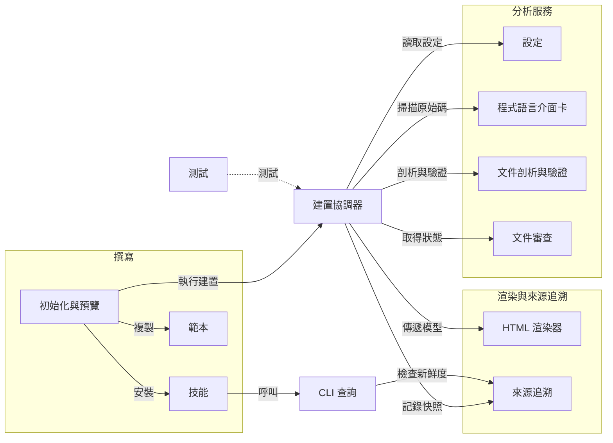

## 架構圖 {#architecture-map}

**選擇一項職責以查看細節。** 藍色節點開啟指南，綠色節點開啟特定章節。實線箭頭由呼叫者或使用者指向其使用的服務；虛線箭頭表示測試涵蓋的對象。

**建置協調器**由 `run()` 與 `analyze()` 實作，負責協調各項職責。其節點連到[協調流程](build.html#orchestration)。**建置管線**是涵蓋分析、審查狀態、渲染與發佈的完整過程；請參閱獨立的[建置流程圖](build.html#inside-the-pipeline)，瞭解執行順序與輸出。

此圖呈現主要協作關係，並非執行順序或所有函式呼叫。同一個 Python 模組可以負責多項職責，例如協調與 HTML 渲染都在 `build.py` 中實作。圖中的群組用來整理職責，不是編號的管線階段。

## 重點摘要 {#tl-dr}

- 套件負責引擎、程式語言介面卡、預設渲染器、技能與範本。
- 專案實例負責自己的 Markdown、設定、原始碼標籤與客製化內容。
- 元件關係由 Markdown 作者描述；原始碼標籤將說明綁定到真正的宣告。

安裝與日常撰寫操作請先閱讀獨立的[使用手冊](user-manual.html)。網站將手冊根頁排在架構之前；這張圖則介紹框架內部元件。兩個分支使用相同的文件模型、索引與渲染器。

## 跟著一次建置走 {#follow-one-build}

從 `codewiki build --strict` 開始。同一份文件模型提供兩種閱讀介面：

1. **找到專案。** `Wiki` 載入設定並解析原始碼根目錄。[查看專案實例](#instances)。
2. **讀取證據。** 介面卡找出宣告與標籤；Markdown 剖析器找出頁面與可定址章節。[探索程式語言介面卡](languages.html)。
3. **連結說明。** 驗證程序將穩定的文件錨點連到實作，並檢查失效參照。[探索文件驗證](documents.html#validation)。
4. **發佈結果。** 建置器產生可離線閱讀的 HTML Wiki，以及供漸進式查詢使用的 JSON 索引。[檢視建置函式](#pipeline)。

## 核心概念 {#concepts}

### 專案實例使用已安裝的框架 {#instances}

設定路徑相對於 `wiki.config.yaml`，因此同一個套件可透過選擇設定檔來建置不同專案。原始碼根路徑可以是單一檔案或目錄。新實例將 Markdown 與客製化內容保留在自己的儲存庫中，不複製 Python 引擎或預設 HTML 主題。設定探索依序檢查明確指定的路徑、環境變數與上層目錄。

### 一次建置，提供兩種閱讀介面 {#pipeline}

建置程序掃描原始碼宣告與文件、驗證關係，再將穩定的錨點 ID 連到實作，最後寫出 JSON 索引與靜態 HTML。Markdown 仍是作者維護的原始依據。索引保存原始 Markdown 章節與原始碼位置，只有在提出請求時才讀取原始碼文字。嚴格驗證出錯時，保留上一次發佈的索引與網站。

## 進入點 {#entry-points}

`codewiki build` 負責驗證與渲染；`codewiki query tree` 是 LLM 閱讀路徑的起點；`codewiki serve` 提供本機撰寫循環；`codewiki init` 建立專案 Wiki。`codewiki review status` 根據目前輸入列出待審查項目；`codewiki review check` 檢查審查是否完成。各子頁說明這些命令依賴的契約。

## 開放問題 {#open-questions}

- 未來需要更多語言時，第三方剖析器介面卡應如何發佈？
- 後續版本是否應將大型原始碼索引存放在獨立的磁碟儲存區？

## 驗證 {#verification}

[測試架構](testing.html) 整理從剖析器測試資料、文件驗證、漸進式查詢，到發佈與圖表連結的自動化檢查。選擇測試領域即可查看斷言與原始碼實作。

瀏覽器互動、已安裝 wheel 的基本檢查，以及與原始 P721 引擎的比較，都是獨立的驗證工作。測試指南說明這些界線與自動化測試套件的執行方式。
