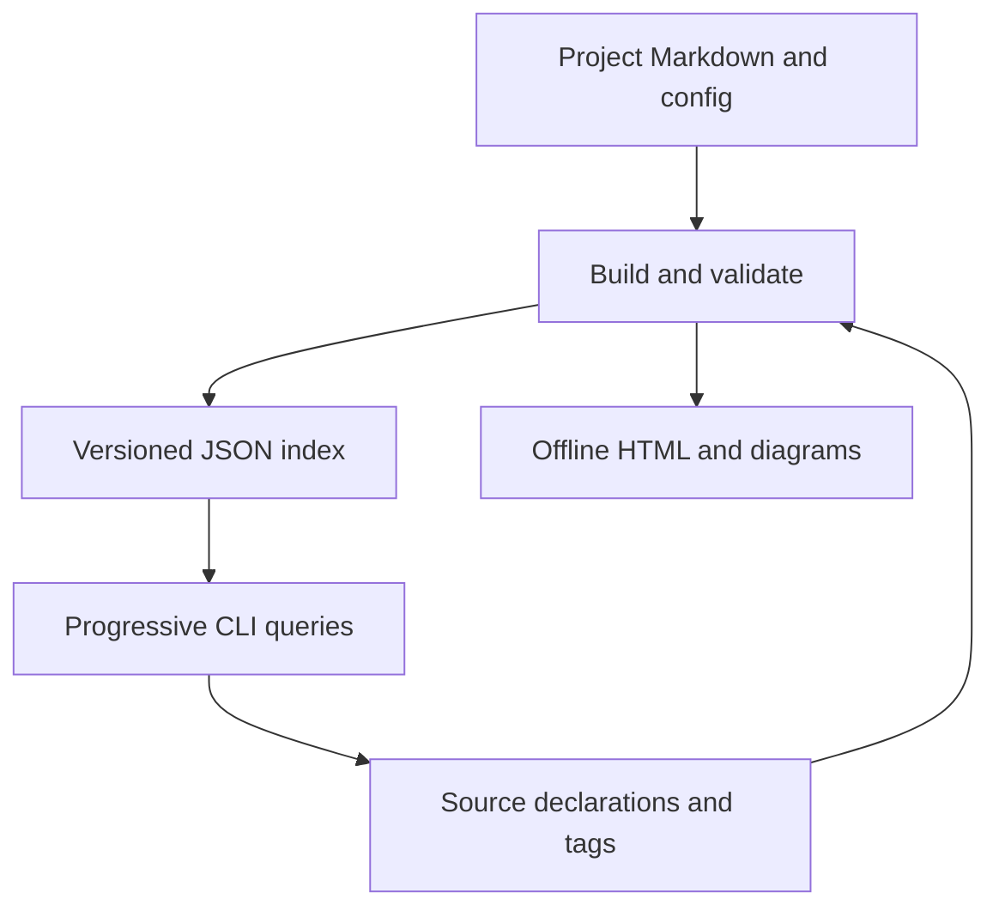

## TL;DR

- The installed package owns the core, language adapters, default theme, and reusable templates.
- Each source repository owns its wiki Markdown, configuration, code tags, and optional theme overrides.
- Builds create a derived index; humans and LLMs follow the same document hierarchy.

## Mental Model

## Concepts

### A project instance uses an installed framework {#instances}

Configuration paths are relative to `wiki.config.yaml`, so the same package can
build any project by selecting its config. Source roots can be individual files
or directories. A new instance keeps Markdown and customization in its repository;
it does not copy the Python engine or default HTML theme. Config discovery checks
an explicit path, the environment, and then parent directories.

### Build once, expose two reading interfaces {#pipeline}

The build scans source declarations and documentation, validates their relationships,
and joins stable anchor IDs to implementations. It then writes a JSON index and
static HTML. Markdown remains the authored source of truth. The index stores original
Markdown sections and source locations; source text is retrieved only on request.
Strict validation errors leave the last published index and site in place.

## Entry Points

`codewiki build` validates and renders; `codewiki query tree` begins the LLM reading
path; `codewiki serve` provides a local authoring loop; `codewiki init` starts a
project wiki. Explore the child pages for the contracts each command relies on.

## Open Questions

- How should third-party parser adapters be distributed once more languages are needed?
- Should future releases keep large source indexes in a separate on-disk store?

## Verification

The extracted framework is checked against fresh builds of the original P721 engine,
comparing anchor IDs and bound implementations on the same source checkout.
