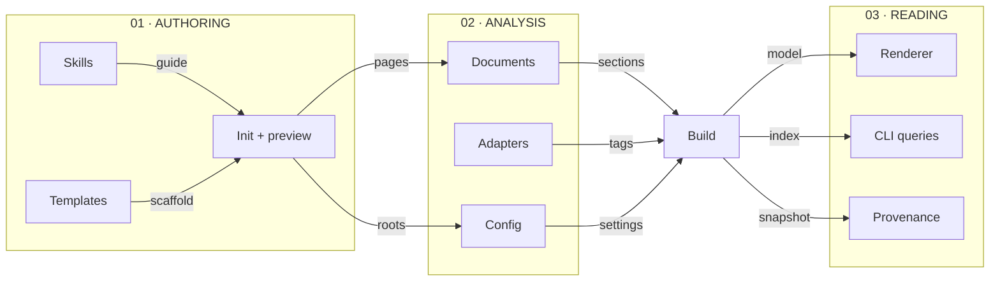

## Architecture map

**Select a component to go one level deeper.** Blue nodes open component guides;
green nodes reveal a section. Arrows describe the labelled flow of data or use.

## TL;DR

- The package owns the engine, language adapters, default renderer, skills, and templates.
- Project instances own their Markdown, configuration, source tags, and customizations.
- Component relationships are authored in Markdown; source tags bind explanations to real declarations.

## Follow one build

Start with `codewiki build --strict`. The same document model feeds both reading interfaces:

1. **Find the project.** `Wiki` loads the configuration and resolves its source roots. [See project instances](#instances).
2. **Read the evidence.** Adapters find declarations and tags; the Markdown parser finds pages and addressable sections. [Explore language adapters](languages.html).
3. **Connect the explanation.** Validation joins stable document anchors to their implementations and checks for broken references. [Explore document validation](documents.html#validation).
4. **Publish the result.** The builder produces an offline HTML wiki and a JSON index for progressive queries. [Inspect the build function](#pipeline).

## Concepts

### A project instance uses an installed framework {#instances}

Configuration paths are relative to `wiki.config.yaml`, so the same package can
build any project by selecting its config. Source roots can be individual files
or directories. A new instance keeps Markdown and customization in its repository;
it does not copy the Python engine or default HTML theme. Config discovery checks
an explicit path, the environment, and then parent directories.

### Build once, expose two reading interfaces {#pipeline}

The build scans source declarations and documentation, validates their relationships,
and joins stable anchor IDs to implementations. It then writes a JSON index and
static HTML. Markdown remains the authored source of truth. The index stores original
Markdown sections and source locations; source text is retrieved only on request.
Strict validation errors leave the last published index and site in place.

## Entry Points

`codewiki build` validates and renders; `codewiki query tree` begins the LLM reading
path; `codewiki serve` provides a local authoring loop; `codewiki init` starts a
project wiki. Explore the child pages for the contracts each command relies on.

## Open Questions

- How should third-party parser adapters be distributed once more languages are needed?
- Should future releases keep large source indexes in a separate on-disk store?

## Verification

The extracted framework is checked against fresh builds of the original P721 engine,
comparing anchor IDs and bound implementations on the same source checkout.
