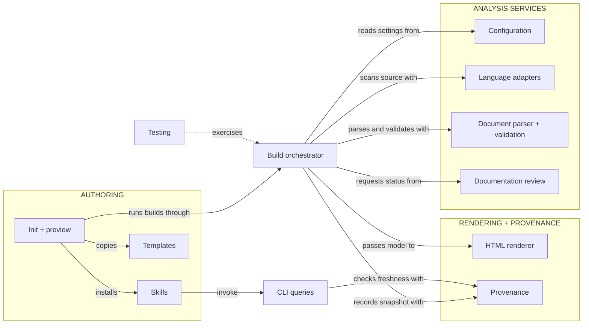

## Architecture map

**Select a responsibility to inspect it.** Blue nodes open guides; green nodes
open a specific section. Solid arrows point from a caller or consumer to the
service it uses. The dotted arrow identifies what the tests exercise.

**Build orchestrator** is the coordinating responsibility implemented by `run()`
and `analyze()`. Its node opens [Orchestration](build.html#orchestration).
The **build pipeline** is the complete process spanning analysis, review status,
rendering, and publication; follow the separate
[build pipeline diagram](build.html#inside-the-pipeline) to see execution order
and outputs.

This map shows primary collaborations, not execution order or every function call.
Responsibilities can share a Python module: orchestration and HTML rendering both
have implementations in `build.py`. Diagram groups organize responsibilities;
they are not numbered pipeline stages.

## TL;DR

- The package owns the engine, language adapters, default renderer, skills, and templates.
- Project instances own their Markdown, configuration, source tags, and customizations.
- Component relationships are authored in Markdown; source tags bind explanations to real declarations.

For installation and everyday authoring, start with the separate
[User manual](user-manual.html). The website places that root before Architecture;
this map follows the framework's internal components. Both branches use the same
document model, index, and renderer.

## Follow one build

Start with `codewiki build --strict`. The same document model feeds both reading interfaces:

1. **Find the project.** `Wiki` loads the configuration and resolves its source roots. [See project instances](#instances).
2. **Read the evidence.** Adapters find declarations and tags; the Markdown parser finds pages and addressable sections. [Explore language adapters](languages.html).
3. **Connect the explanation.** Validation joins stable document anchors to their implementations and checks for broken references. [Explore document validation](documents.html#validation).
4. **Publish the result.** The builder produces an offline HTML wiki and a JSON index for progressive queries. [Inspect the build function](#pipeline).

## Concepts

### A project instance uses an installed framework {#instances}

Configuration paths are relative to `wiki.config.yaml`, so the same package can
build any project by selecting its config. Source roots can be individual files
or directories. A new instance keeps Markdown and customization in its repository;
it does not copy the Python engine or default HTML theme. Config discovery checks
an explicit path, the environment, and then parent directories.

### Build once, expose two reading interfaces {#pipeline}

The build scans source declarations and documentation, validates their relationships,
and joins stable anchor IDs to implementations. It then writes a JSON index and
static HTML. Markdown remains the authored source of truth. The index stores original
Markdown sections and source locations; source text is retrieved only on request.
Strict validation errors leave the last published index and site in place.

## Entry Points

`codewiki build` validates and renders; `codewiki query tree` begins the LLM reading
path; `codewiki serve` provides a local authoring loop; `codewiki init` starts a
project wiki. `codewiki update` upgrades the framework and reconciles an existing
instance; [Instance updates](updates.html) describes release/source selection and
customization preservation. `codewiki review status` lists pending reviews from live inputs;
`codewiki review check` enforces their completion. Explore the child pages for the contracts each command relies on.

## Open Questions

- How should third-party parser adapters be distributed once more languages are needed?
- Should future releases keep large source indexes in a separate on-disk store?

## Verification

[Testing architecture](testing.html) maps the automated checks from parser fixtures
through document validation, progressive queries, publication, and diagram links.
Select a test area to inspect the assertions and their source implementations.

Browser interaction, installed-wheel smoke checks, and comparison against the original
P721 engine are separate verification activities; the testing guide explains these
boundaries and how to run the automated suite.
