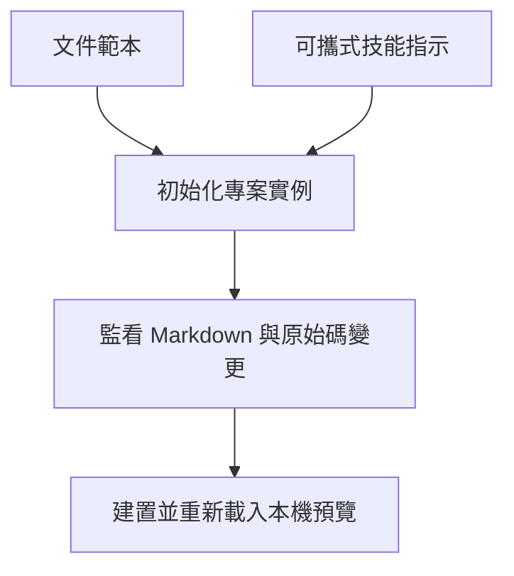

## 撰寫循環 {#the-authoring-loop}

## 重點摘要 {#tl-dr}

- 初始化會建立專案擁有的設定、起始 Markdown、範本與可攜式技能。
- 穩定 ID 與原創說明保留在原始碼儲存庫中。
- 本機伺服器在輸入變更時重新建置，並回報驗證失敗。

## 核心概念 {#concepts}

### 只建立專案應擁有的檔案 {#scaffold}

`codewiki init --root <project> --code-root src` 建立 `codewiki/` 實例。重複使用 `--code-root` 可加入更多原始碼根目錄。初始化會保留既有實例檔案，升級時不會覆寫使用者的客製化內容。只有在尚無已撰寫頁面時才加入架構起始頁。複製的範本涵蓋架構、子系統、元件與決策文件；請用觀察到的事實取代起始文字。選用的 shell、Git hook 與 CI 範例會複製到 `integrations/`，但不會安裝 hook 或變更遠端儲存庫政策。

初始化會在專案根目錄的 `AGENTS.md` 建立或附加帶標記的區段，要求原始碼與文件工作遵循實例指南。它直接附加位元組，不重寫既有根目錄指示。標記包含正規化後相對於專案的指南路徑，因此重複初始化會保留客製化區段，不同實例則各有參照。`--dir` 決定參照路徑。舊實例重新初始化時會加入根目錄參照，既有實例檔案仍維持原樣。

初始化也會在 `.codewiki-manifest.json` 記錄完全相符的套件副本雜湊與相對專案根目錄，不將既有客製化檔案當成原始副本。請將 manifest 納入 Git；[實例更新](updates.html) 用它更新未修改的支援檔案，並偵測需要整合的變更。

`--client claude` 會加入 Claude Code 整合：在專案根目錄的 `CLAUDE.md` 附加相同的帶標記區段，並將套件內的技能複製到 Claude Code 掃描專案技能的 `.claude/skills/`。該處既有檔案會保留，因此客製化技能不會被重複初始化覆寫。`AGENTS.md` 一律會寫入；舊實例日後也可加上此旗標。

### 預覽建置契約 {#preview}

`codewiki serve` 在本機迴路位址提供產生的 HTML，並在監看的輸入變更時重新建置。瀏覽器重新載入通知與驗證錯誤屬於開發伺服器；沒有伺服器時，靜態建置輸出仍可使用。變更輸出目錄後請重新啟動伺服器。CLI 查詢直接使用已儲存的索引，不需要伺服器。

## 技能 {#skills}

框架在 `src/codewiki/resources/skills/` 提供 `wiki-init`、`wiki-query`、`wiki-author`、`wiki-build` 與 `wiki-review`。初始化會將它們複製到實例中。每項技能都使用已安裝的 CLI，因此任何能載入 `SKILL.md` 的客戶端都可使用。初始化會加入根目錄的代理參照，讓指南適用於整個專案；加上 `--client claude` 時，也會將技能安裝到 `.claude/skills/`，並在 `CLAUDE.md` 參照指南。其他客戶端請透過各自的探索機制註冊實例中的副本。

## 維護 {#maintenance}

修改已有文件涵蓋的檔案前，先查詢其文件。行為改變時，在同一次變更中更新說明。移動或重新命名宣告時保留原始碼標籤；設定為唯讀的程式碼使用文件端參照。執行嚴格建置，接著透過瀏覽器與 CLI 檢查受影響章節。

## 預覽輸入 {#preview-inputs}

預覽會監看實例設定、Markdown、原始碼根目錄、明確擁有或參照的資產、審查紀錄與主題檔案。重新建置前會重新載入設定，因此可識別變更後的原始碼根目錄。設定無效時，預覽會持續顯示錯誤直到修正。
