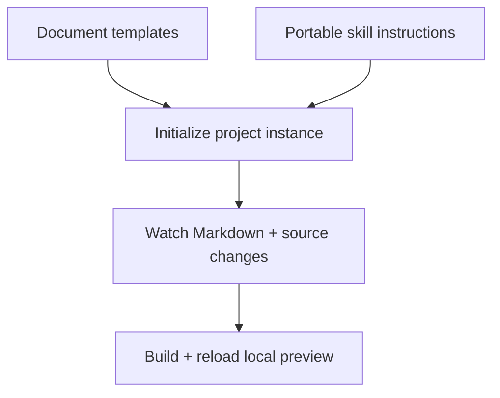

## The authoring loop

## TL;DR

- Initialization creates project-owned config, starter Markdown, templates, and portable skills.
- Stable IDs and original explanations stay with the source repository.
- The local server rebuilds on input changes and reports validation failures.

## Concepts

### Scaffold only the project-owned files {#scaffold}

`codewiki init --root <project> --code-root src` creates a `codewiki/` instance.
Repeat `--code-root` for additional source roots. Initialization preserves existing
instance files and does not replace user customizations on an upgrade. It adds an architecture
starter only when there are no authored pages. The copied templates cover architecture,
subsystem, component, and decision documents. Replace starter text with observed facts.
Optional shell, Git hook, and CI examples are copied into `integrations/` without
installing hooks or changing remote repository policy.

Initialization creates or appends a marked section in the project-root `AGENTS.md`
that directs source and documentation work to the instance guide. It appends bytes
without rewriting existing root instructions. The marker includes the normalized
project-relative guide path, so repeating init preserves a customized section and
different instances receive separate references. `--dir` controls that path. Older
instances gain the root reference on re-initialization while their files stay intact.

Initialization also records exact package-copy hashes and the relative project root
in `.codewiki-manifest.json`. Existing customized files are not treated as pristine
copies. Keep the manifest in Git; [Instance updates](updates.html) uses it to refresh
untouched support files and detect changes that need reconciliation.

### Preview the build contract {#preview}

`codewiki serve` serves generated HTML on loopback and rebuilds when watched inputs
change. Browser reload notifications and validation errors belong to the development
server; static build output stays usable without it. Restart the server if changing
the configured output directory. CLI queries work from the saved index without a server.

## Skills

The framework ships `wiki-init`, `wiki-query`, `wiki-author`, `wiki-build`, and `wiki-review` under
`src/codewiki/resources/skills/`. Initialization copies them into the instance. Each uses
the installed CLI, so it has no dependency on a Claude-specific plugin directory.
Use the relevant client's skill discovery mechanism to register these files.
Initialization adds the root agent reference for project-wide behavior; skill
registration remains a separate client integration step.

## Maintenance

Query a covered file before changing it. If behavior changes, update its explanation
in the same change. Preserve source tags when moving or renaming declarations and
use document-side references for code configured as read-only. Run a strict build,
then inspect the affected section through both the browser and CLI.

## Preview Inputs

The preview watches the instance configuration, Markdown, source roots, explicitly owned/referenced assets, review records, and theme
files. It reloads configuration before rebuilding so changed source roots are picked
up. Invalid configuration appears as a preview error until corrected.
