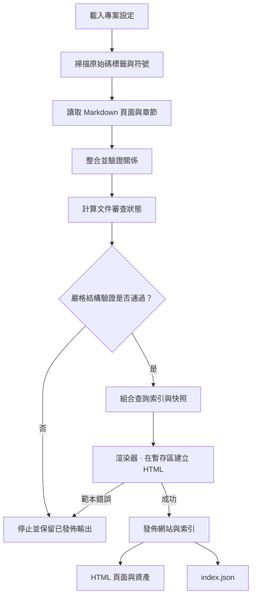

本指南涵蓋兩個範圍：圖表描繪**完整建置管線**，[協調流程](#orchestration) 則說明呼叫各階段的**協調器**。[架構圖](architecture.html#architecture-map) 的建置協調器節點直接連到該章節。渲染器是協調器使用的服務之一，也是完整流程中的一個階段。

## 管線內部 {#inside-the-pipeline}

這裡的箭頭代表**執行順序**。此圖呈現流程，因此方框表示操作，而非同層元件。選擇操作即可檢視負責的元件。

此圖依照 `codewiki build --strict` 的流程。原始碼掃描與 Markdown 剖析依序執行。待處理的文件審查不會讓結構驗證失敗；CI 中獨立的審查完成關卡是 `codewiki review check`。無效輸入或審查紀錄也可能在發佈前中止建置。發佈本身具有[下方說明的界線](#publication)。

## 協調流程 {#orchestration}

**建置協調器**負責協調整個過程。`run()` 呼叫 `analyze()` 掃描原始碼、剖析 Markdown，並將標籤連到穩定錨點。接著取得審查狀態、檢查結構診斷、組合索引、將模型交給 `render_site()`，最後發佈暫存結果。獨立審查 API 重用 `analyze()`，不進行渲染或發佈。

使用 `--strict` 時，驗證錯誤會停止發佈並保留上一次有效輸出。待處理文件審查與未實作概念的資訊提示不會阻擋發佈。請以 `codewiki review check` 作為獨立審查關卡。

程式語言介面卡負責語法相關擷取，文件剖析器負責 Markdown 結構，渲染器負責組合 HTML。協調器決定何時呼叫各項職責。`Tag`、`Ref`、`Anchor` 與 `Doc` 在驗證及渲染間傳遞整合模型。文件相依清單中的**使用者：建置管線**連到本指南；呼叫者是此處說明的協調器，不是另一個管線階段。

## 查詢索引 {#index}

`build_index()` 匯出文件摘要、父子關係、相依關係、圖表目的地、原始 Markdown 章節與原始碼符號位置。`by_file` 檢視可在不載入所有章節的情況下，完成檔案到文件的查找。符號索引不包含原始碼宣告文字；只有查詢請求時，才從已確認版本的工作目錄讀取有限範圍的原始碼。

快照記錄輸入指紋與儲存庫狀態，讓查詢偵測過期行範圍，但無法證明說明正確。

只有標準英文文件會依 Markdown 路徑排序進入索引；翻譯同層檔案另行驗證，用於 HTML 渲染。渲染器建立自己的導覽樹並將手冊根頁排在前方，不會重新排序索引。CLI 依索引的父子階層走訪，因此根頁順序可能與 HTML 側邊欄不同，但頁面與關係相同。

文件審查使用另存於 `reviews/` 並納入版本管理的紀錄。`run()` 將目前輸入與紀錄比較，並在索引與 HTML 中加入報告。`outdated-doc` 表示已審查的內容發生變更；`unreviewed-doc` 在初次基準建立前屬於資訊提示。舊有依 Git 日期判斷的 `stale-doc` 啟發式已被取代。重新建置不會變更審查紀錄。請見[文件審查](reviews.html)。

## 發佈界線 {#publication}

HTML 先在暫存目錄中完成渲染。範本錯誤會保留先前發佈的輸出。成功後，檔案複製到網站，刪除前次索引記錄的過期頁面（包含 `rendered_pages` 語言清單），最後以暫存索引取代舊索引。整個網站目錄並非以原子方式交換，因此發佈期間讀者可能短暫看到不同建置的檔案。預覽伺服器會在建置後重新載入。

## 應在哪裡修改行為 {#where-to-change-behavior}

| 變更 | 進入點 |
| --- | --- |
| 新增診斷 | `join()` 與 `SEVERITY` 對應 |
| 匯出另一種關係 | `build_index()` 與查詢使用端 |
| 修改導覽或頁面配置 | [渲染器](renderer.html) |
| 加入原始碼語法 | [程式語言介面卡](languages.html) |

嚴格建置與框架測試涵蓋失效參照、過期範圍、渲染失敗，以及刪除頁面後的輸出清理。
