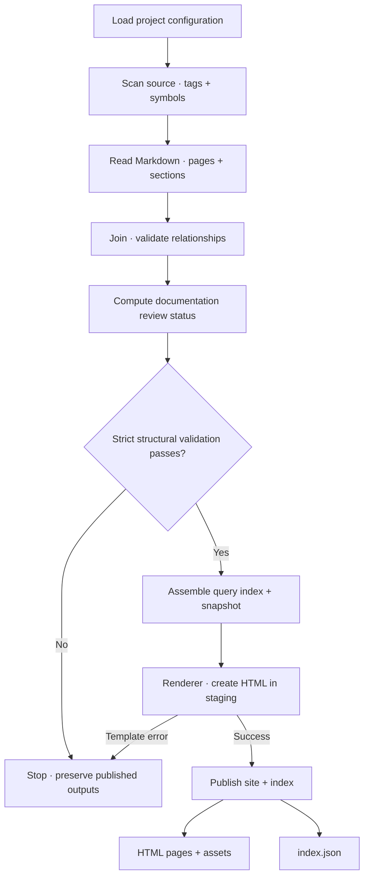

This guide has two scopes: the diagram traces the **whole build pipeline**, while
[Orchestration](#orchestration) explains the **coordinator** that invokes its stages.
The [architecture map](architecture.html#architecture-map) links its Build
orchestrator node directly to that section. The Renderer is one service used by
the coordinator and one stage within the complete process.

## Inside the pipeline

Arrows here mean **execution order**. This is a process view, so its boxes are
operations rather than peer components. Select an operation to inspect its owner.

The diagram follows `codewiki build --strict`. Source scanning and Markdown parsing
run sequentially. Pending documentation reviews do not fail structural validation;
`codewiki review check` is the separate review-completion gate for CI. Invalid input
or review records can also abort the build before publication. Publication itself
has the [boundaries described below](#publication).

## Orchestration {#orchestration}

The **Build orchestrator** coordinates the process. `run()` calls `analyze()` for
source scanning, Markdown parsing, and joining tags to stable anchors. It then
requests review status, checks structural diagnostics, assembles the index,
invokes `render_site()` with the model, and publishes the staged results. The
standalone review API reuses `analyze()` without rendering or publishing.

With `--strict`, validation errors stop publication and preserve the last good
outputs. Pending documentation reviews and informational unimplemented concepts
do not block publication. Use `codewiki review check` as the separate review gate.

Language adapters own syntax-specific extraction, the document parser owns Markdown
structure, and the Renderer owns HTML composition. The orchestrator chooses when
to invoke these responsibilities. `Tag`, `Ref`, `Anchor`, and `Doc` carry the combined
model through validation and rendering. In document-level dependency lists,
**Used by: Build pipeline** links to this guide; the caller is the orchestrator
explained here, not an additional pipeline stage.

## Query index {#index}

`build_index()` exports document summaries, parent/child relationships, dependencies,
diagram destinations, original Markdown sections, and source symbol locations. The
`by_file` view makes file-to-document lookup possible without loading every section.
Source declaration text is excluded from the symbol index; the query command reads
bounded source ranges from a verified checkout when requested.

The snapshot fingerprints inputs and records repository state. It lets queries
detect stale ranges, but does not prove an explanation is correct.

Only canonical English documents enter the index, in sorted Markdown-path order.
Translation siblings are validated separately for HTML rendering. The renderer builds its
own navigation tree and places manual roots first; it does not reorder the index.
The CLI walks the indexed parent hierarchy, so its root order can differ from the
HTML sidebar while preserving the same pages and relationships.

Documentation review uses separate committed records under `reviews/`.
`run()` compares current inputs with those records and includes a report in the
index and HTML. An `outdated-doc` warning means reviewed content changed;
`unreviewed-doc` is informational until an initial baseline is recorded. The old
Git-date-based `stale-doc` heuristic has been replaced. Rebuilding never changes
review records. See [Documentation review](reviews.html).

## Publication boundaries {#publication}

HTML is first rendered in a temporary directory. Template errors leave previously
published outputs intact. On success, files are copied to the site, obsolete pages
listed in the previous index (including the `rendered_pages` language manifest) are retired, and a temporary index replaces the old one.
The entire site directory is not swapped atomically: a reader during publication
can briefly see files from different builds. The preview server reloads after build.

## Where to change behavior

| Change | Entry point |
| --- | --- |
| Add a diagnostic | `join()` and the `SEVERITY` mapping |
| Export another relationship | `build_index()` and query consumers |
| Change navigation or page layout | [Renderer](renderer.html) |
| Add a source syntax | [Language adapters](languages.html) |

The strict build and framework tests cover broken references, stale ranges,
failed rendering, and retiring deleted pages.
