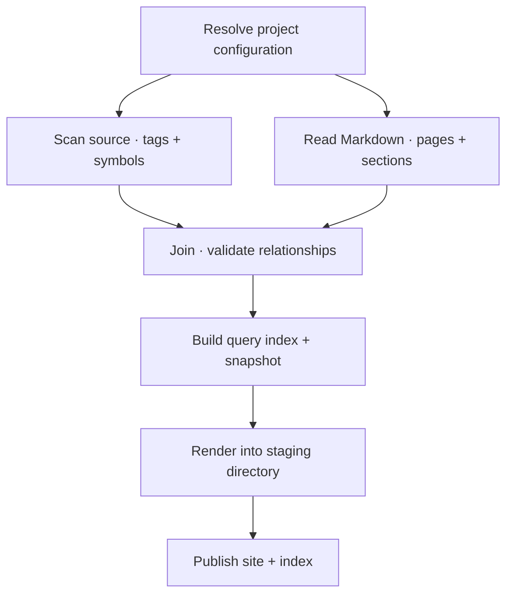

## Inside the pipeline

This is the execution order of `codewiki build --strict`. Select a stage to read
its implementation. Scanning and parsing are drawn as separate inputs to the join;
the current Python builder executes them sequentially.

## Orchestration {#orchestration}

`run()` delegates scanning, Markdown parsing, and joining tags to stable anchors
to `analyze()`. The review API reuses this analysis without publishing outputs. It aggregates diagnostics before deciding whether publication can
proceed. With `--strict`, any error returns a failure and keeps the last good outputs.
Pending documentation reviews and informational unimplemented concepts do not block
publication. Use `codewiki review check` as the separate review gate.

The builder coordinates other components; the language adapters own syntax-specific
extraction, and the document parser owns Markdown structure. `Tag`, `Ref`, `Anchor`,
and `Doc` carry the combined model through validation and rendering.

## Query index {#index}

`build_index()` exports document summaries, parent/child relationships, dependencies,
diagram destinations, original Markdown sections, and source symbol locations. The
`by_file` view makes file-to-document lookup possible without loading every section.
Source declaration text is excluded from the symbol index; the query command reads
bounded source ranges from a verified checkout when requested.

The snapshot fingerprints inputs and records repository state. It lets queries
detect stale ranges, but does not prove an explanation is correct.

Documents enter the index in sorted Markdown-path order. The renderer builds its
own navigation tree and places manual roots first; it does not reorder the index.
The CLI walks the indexed parent hierarchy, so its root order can differ from the
HTML sidebar while preserving the same pages and relationships.

Documentation review uses separate committed records under `reviews/`.
`run()` compares current inputs with those records and includes a report in the
index and HTML. An `outdated-doc` warning means reviewed content changed;
`unreviewed-doc` is informational until an initial baseline is recorded. The old
Git-date-based `stale-doc` heuristic has been replaced. Rebuilding never changes
review records. See [Documentation review](reviews.html).

## Publication boundaries {#publication}

HTML is first rendered in a temporary directory. Template errors leave previously
published outputs intact. On success, files are copied to the site, obsolete pages
listed in the previous index are retired, and a temporary index replaces the old one.
The entire site directory is not swapped atomically: a reader during publication
can briefly see files from different builds. The preview server reloads after build.

## Where to change behavior

| Change | Entry point |
| --- | --- |
| Add a diagnostic | `join()` and the `SEVERITY` mapping |
| Export another relationship | `build_index()` and query consumers |
| Change navigation or page layout | [Renderer](renderer.html) |
| Add a source syntax | [Language adapters](languages.html) |

The strict build and framework tests cover broken references, stale ranges,
failed rendering, and retiring deleted pages.
