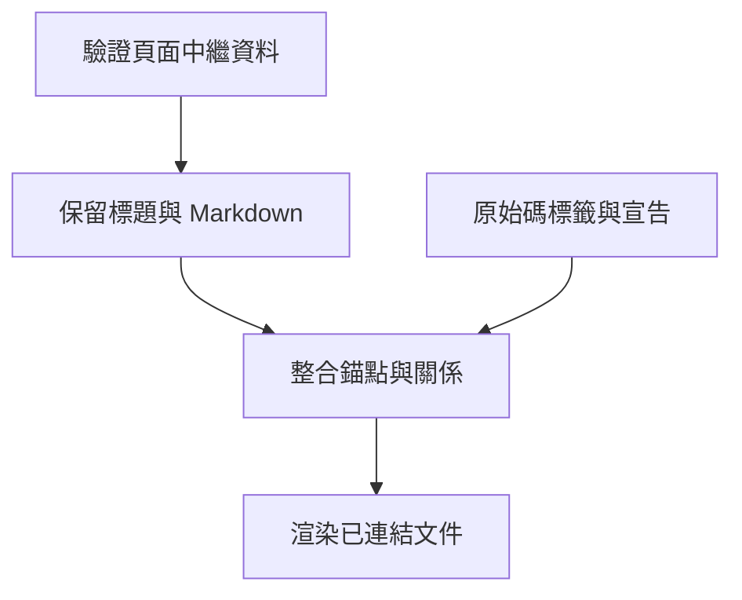

## 文件模型內部 {#inside-the-document-model}

## 重點摘要 {#tl-dr}

- Frontmatter 宣告身分、階層、檔案責任、相關頁面與選用決策。
- 所有 Markdown 標題都可定址；明確 slug 提供穩定的程式碼錨點。
- HTML 使用套件預設值，允許專案逐檔覆寫。

## 核心概念 {#concepts}

### Frontmatter 是共用契約 {#frontmatter}

每頁都需要安全且唯一的 `id`。`title`、`summary`、`status` 協助讀者理解頁面；`parent` 選擇主要階層；`related` 加入交叉連結。`owns` 指定原始碼檔案的主要說明文件。`refs` 透過檔案與符號連到無法加標籤的原始碼。路徑相對於設定目錄。沒有 `parent` 的既有頁面維持頂層；缺少摘要時使用 TL;DR 項目。

根頁的 `type: manual` 為整個分支選擇依實際階層顯示的閱讀路徑，包括沒有指定該 type 的後代頁面。預設 HTML 導覽將手冊根頁排在其他根頁之前。階層依 `parent`，而非資料夾配置；同層順序依 Markdown 路徑探索順序。重新命名檔案可能改變順序，但不改變穩定頁面 ID 或輸出網址。

### 章節保留原始 Markdown {#sections}

剖析器辨識反引號或波浪號程式碼區塊以外的一至六級標題。每個章節保存精確 Markdown、文件行範圍、層級與 ID。讀取章節時包含其巢狀子章節；渲染器只使用各標題的直接主體，避免重複渲染子章節文字。`### Parse {#parse}` 這類明確標題定義 `document-id.parse`；隱含 ID 供瀏覽使用，不應當作永久標籤。

### 驗證整合模型 {#validation}

關聯驗證檢查缺少的錨點目標、重複頁面 ID、檔案責任衝突、未知相關頁面、無效父頁、父子循環與失效決策錨點。無法解析的 `refs` 符號是錯誤。沒有程式碼標籤的概念屬於資訊提示，可能是高層說明或草稿的刻意安排。

### 渲染使用預設值與選用覆寫 {#rendering}

Jinja 範本、CSS、Mermaid 與語法醒目提示隨套件提供。專案的 `wiki/_theme/` 可覆寫個別檔案。既有完整主題保留舊的範本資料契約。新主題渲染文件階層、子頁摘要、標題、連結實作與決策紀錄。預設閱讀配置在寬螢幕上將專案樹與頁面目錄分開，先呈現說明再顯示相關頁面，並讓原始碼參照可展開。小型頁名篩選器與目前章節指示器漸進增強靜態 HTML。Mermaid 只在含圖表的頁面載入；程式碼可見時才載入語法醒目提示。

產生的檔案可離線使用。HTML 預期用於受信任的專案文件；Markdown 可包含原始 HTML，Mermaid 也支援互動連結。

## 開放問題 {#open-questions}

- 有需要時可加入 setext 標題等更廣泛的 Markdown 支援。
- 架構關係由作者撰寫；渲染器不推論語意呼叫圖。

## 建置發佈 {#build-publication}

產生的檔案發佈前，先在暫存目錄完成渲染。範本錯誤保留既有索引與網站。成功重建後，文件已刪除且記錄於先前索引的頁面會被移除。

## 元件關係與圖表 {#component-relationships-and-diagrams}

`depends_on` 列出描述此頁所依賴元件的文件 ID。渲染器與查詢索引推導反向 `used_by` 連結。這些是作者描述的架構關係，不是推論的匯入圖或呼叫圖；循環可能合理，因此允許存在。缺少相依頁面會造成嚴格建置錯誤。

`diagram_links` 將 Mermaid 節點識別碼對應到精確文件或章節 ID。例如 `diagram_links: {engine: build, validate: documents.validation}` 將一個節點連到頁面，另一個連到實作章節。未知目標是嚴格錯誤。本地標題 slug 與文件 ID 也可自動解析；明確對應優先。如果文件 ID 與完整章節 ID 衝突，文件優先。持久連結應使用明確且唯一的標題 slug。

渲染器根據子頁摘要與檔案責任資料顯示元件卡片，並呈現相依標記、反向關係、文字圖表目的地與可用鍵盤操作的 SVG 連結。Markdown 到 HTML 與瀏覽器實作請見[渲染器內部](renderer.html)。
