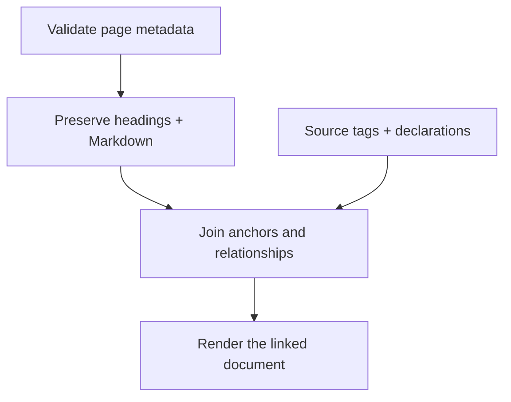

## Inside the document model

## TL;DR

- Frontmatter declares identity, hierarchy, ownership, related pages, and optional decisions.
- All Markdown headings are addressable; explicit slugs provide stable code anchors.
- HTML uses package defaults with per-file project overrides.

## Concepts

### Frontmatter is the shared contract {#frontmatter}

Every page requires a safe, unique `id`. `title`, `summary`, and `status` orient the
reader; `parent` chooses the primary hierarchy; `related` adds cross-links.
`owns` assigns a primary document to a source file. `refs` links untaggable source
by file and symbol. Paths are relative to the configuration directory. Existing
pages without `parent` remain top-level, and TL;DR bullets supply a missing summary.

`type: manual` on a root selects a hierarchy-based reading path for its entire
branch, including descendants that omit that type. The default HTML navigation
places manual roots before other roots. Nesting follows `parent`, not the folder
layout; sibling order follows Markdown-path discovery order. Renaming a file can
change that order without changing the page's stable ID or output URL.

### Sections preserve original Markdown {#sections}

The parser recognizes heading levels one through six outside backtick or tilde
fences. Each section keeps its exact Markdown, document line range, level, and
ID. Reading a section includes its nested subsections. The renderer uses only
the direct body of each heading to avoid rendering child text twice.
An explicit heading such as `### Parse {#parse}` defines `document-id.parse`;
implicit IDs are generated for browsing and should not be used as persistent tags.

### Validation joins the model {#validation}

The join checks missing anchor targets, duplicate page IDs, conflicting ownership,
unknown related pages, invalid parents, parent cycles, and broken decision anchors.
An unresolved `refs` symbol is an error. A concept without a code tag is informational;
that can be intentional for a high-level explanation or a draft page.

### Rendering uses defaults and optional overrides {#rendering}

Jinja templates, CSS, Mermaid, and syntax highlighting ship inside the package.
A project's `wiki/_theme/` overrides individual files. Existing complete themes
retain the old template data contract. New themes render the document hierarchy,
child summaries, headings, linked implementations, and decision records.
The default reading layout separates the project tree from the page outline on
wide screens, presents the explanation before related pages, and keeps source
references expandable. A small page-name filter and active section indicator
progressively enhance the static HTML. Mermaid loads only on diagram pages;
syntax highlighting loads when a code block becomes visible.
Generated files work offline. HTML is intended for trusted project documentation;
Markdown may contain raw HTML and Mermaid supports interactive links.

## Open Questions

- Broader Markdown support such as setext headings may be added when required.
- Architectural relationships are authored; the renderer does not infer a semantic call graph.

## Build Publication

Rendering completes in a temporary directory before generated files are published.
Template errors leave the existing index and site intact. A successful rebuild
removes pages recorded in the previous index when their documents were deleted.

## Component relationships and diagrams

`depends_on` lists document IDs describing the components this page relies on.
The renderer and query index derive reverse `used_by` links. These are authored
architectural relationships, not an inferred import or call graph; cycles may be
valid and are allowed. Missing dependency pages are strict build errors.

`diagram_links` maps Mermaid node identifiers to exact document or section IDs.
For example, `diagram_links: {engine: build, validate: documents.validation}`
links one node to a page and another to an implementation section. Unknown targets
are strict errors. Local heading slugs and document IDs also work automatically;
explicit mappings take precedence. If a document ID collides with a full section
ID, the document wins. Prefer explicit, unique heading slugs for durable links.

The renderer shows component cards from child-page summaries and ownership metadata.
It exposes dependency chips, reverse relationships, text diagram destinations, and
keyboard-accessible SVG links. See [renderer internals](renderer.html) for the
Markdown-to-HTML and browser implementation.
