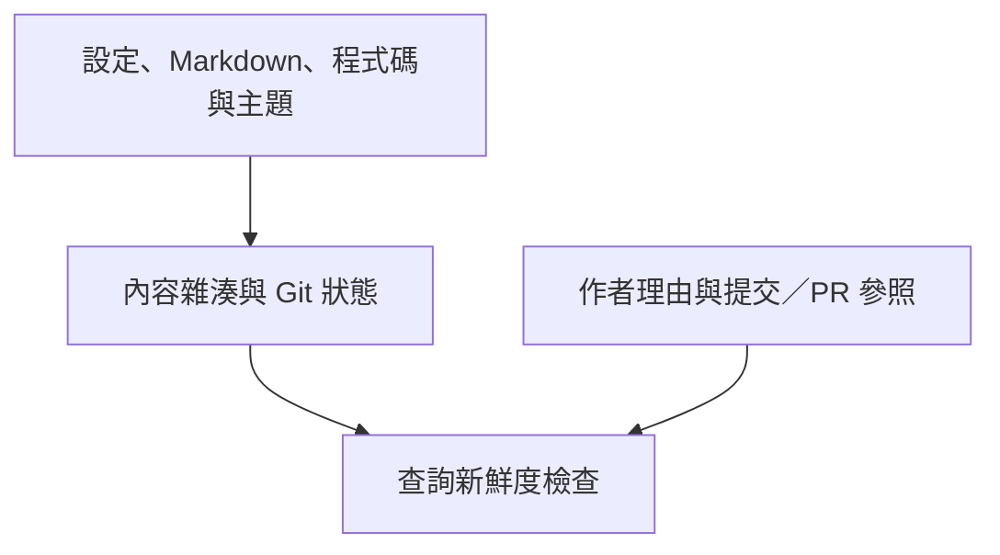

## 索引記住了什麼 {#what-the-index-remembers}

新鮮度判斷使用內容雜湊。決策紀錄與來源資訊一同保存，但由 `query history` 回傳；它們不決定原始碼行範圍是否為目前版本。

## 重點摘要 {#tl-dr}

- 決策紀錄保存作者提供的理由，以及選用的提交／PR 參照。
- 建置快照識別渲染說明時使用的原始碼狀態。
- 自動探索 Git／PR 與重建歷史版本屬於未來工作。

## 核心概念 {#concepts}

### 指紋識別建置實際讀取的內容 {#fingerprints}

每份快照記錄框架版本、輸入內容雜湊，以及所找到 Git 儲存庫的 HEAD 與未提交變更狀態。只有 HEAD 無法完整識別含未提交變更的工作目錄；輸入雜湊能區分實際內容。尚無提交或不存在的儲存庫沒有提交 ID。快照是來源資訊，不代表文件已通過審查，也不表示某個提交能解釋設計理由。

## 決策紀錄 {#decision-records}

頁面的選用 `decisions` 清單包含穩定的本地 `id`、必要的 `reason`，以及選用的 `anchors`、`commits`、`prs` 清單。YAML 中的提交 ID 應加上引號。PR 參照使用 HTTP(S) 網址。系統會驗證錨點目標，但 v1 不會抓取或驗證提交是否存在及 PR 內容。`codewiki query history <doc-id>` 與渲染頁面都會呈現作者提供的紀錄。

## 審查確認 {#review-acknowledgments}

[文件審查元件](reviews.html) 將明確確認另存於 `reviews/<id>.json`。它比較原始碼與文件相對於上次審查的內容；建置快照則識別上一次渲染。重新建置更新來源資訊，但不等於核准說明。Markdown 與審查紀錄都由專案現有的 Git 儲存庫管理版本。

## 未來的變更追蹤 {#future-change-tracking}

未來的命令可比較兩個 Git 修訂版本，將變更的檔案或宣告對應到受影響錨點，並提出文件審查清單。歷史渲染需要相容版本的文件與程式碼。設定 PR 服務整合後，可附加經驗證的中繼資料；理由仍需明確撰寫並以原始碼為依據。v1 不會執行背景監控或自動改寫文字。

## 驗證範圍 {#verification-scope}

未來的 Git 整合必須區分作者提供的決策參照與經驗證的提交／PR 紀錄。目前的實作刻意只呈現作者紀錄與本機建置來源資訊。
