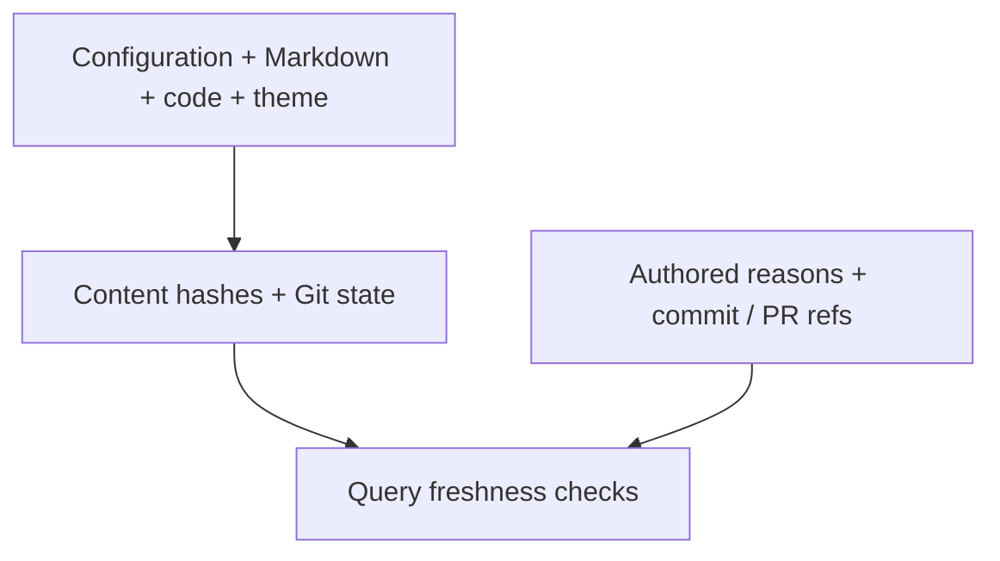

## What the index remembers

Freshness uses content hashes. Decision records travel alongside provenance but
are returned by `query history`; they do not affect whether source ranges are current.

## TL;DR

- Decision records hold supplied reasons and optional commit/PR references.
- Build snapshots identify the source state used for a rendered explanation.
- Automatic Git/PR discovery and historical reconstruction are future work.

## Concepts

### Fingerprints identify what a build actually read {#fingerprints}

Each snapshot records framework version, input content hashes, and any discovered
Git repository's HEAD and dirty status. A dirty checkout is not fully identified by
HEAD alone; the input hashes distinguish its actual content. An unborn or absent
repository has no commit ID. Snapshot data is provenance, not a claim that a document
has been reviewed or that a commit explains the design reason.

## Decision Records

A page's optional `decisions` list contains a stable local `id`, a required `reason`,
and optional `anchors`, `commits`, and `prs` lists. Quote commit IDs in YAML. PR
references are HTTP(S) URLs. Anchor targets are validated; commit existence and PR
contents are not fetched or verified by v1. `codewiki query history <doc-id>` and
the rendered page expose the supplied records.

## Future Change Tracking

A later command can compare two Git revisions, map changed files or declarations
to affected anchors, and propose a documentation review list. Historical rendering
will need the documents and code at compatible revisions. PR-provider integrations
can attach verified metadata when configured, while reasons remain explicit and
source-grounded. No background monitoring or automatic prose rewriting runs in v1.

## Verification Scope

A future Git integration must distinguish a supplied decision reference from a
verified commit/PR record. The current implementation deliberately exposes only
the authored records and local build provenance.
