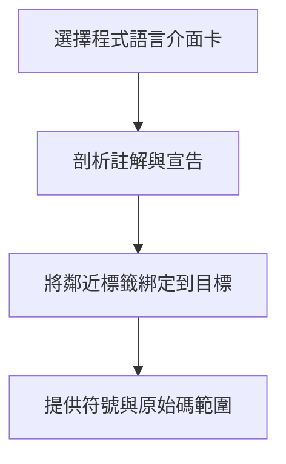

## 從原始碼到證據 {#source-to-evidence}

剖析節點開啟本儲存庫使用的 Python 介面卡。其他支援的語言也實作相同的註解／目標契約。

## 重點摘要 {#tl-dr}

- C、Python、YAML 與 devicetree 使用 Tree-sitter；建置／設定語言使用陳述式掃描器。
- 標籤綁定到下一個鄰近宣告，符號重新命名後仍可保留文件連結。
- 結構剖析提供證據，不是完整的語意模型。

## 核心概念 {#concepts}

### 介面卡共用同一個目標契約 {#registry}

每個介面卡產生註解與宣告目標，包含名稱、種類、位元組範圍、行範圍及選用的限定名稱。建置掃描器將 `@wiki:impl`、`@wiki:gotcha`、`@wiki:entry` 標籤解析到這些目標。附近沒有目標的標籤會成為檔案層級連結。即使宣告沒有文件標籤，原始碼索引仍保存宣告中繼資料供查詢使用。

### Python 讓本儲存庫能記錄自身 {#python}

Python 介面卡辨識函式、類別、帶裝飾器的宣告與簡單賦值。巢狀定義具有 `Wiki.rel` 之類的限定名稱。裝飾器上方的註解會綁定到被裝飾的宣告。CLI 加上由檔案推導的前綴，因此不必先載入檔案，就能選取 `codewiki.build.run`。原始碼擷取包含裝飾器與宣告主體。

## 限制 {#constraints}

C 介面卡針對 C 文法，不保證完整支援 C++。Make、shell、Kconfig、CMake 與 `.conf` 掃描器提供實用的陳述式邊界，但不宣稱涵蓋完整語意。前置處理條件與執行時分派仍需檢視原始碼。名稱有歧義時，應使用檔案或作用域限定名稱。

## 新增語言 {#adding-a-language}

提供回傳共用 `Comment` 與 `Target` 紀錄的掃描器，註冊 `LangSpec`，並在 `DEFAULT_FILE_MAP` 對應副檔名或基本檔名。加入測試資料，檢查實際標籤綁定、限定名稱與原始碼範圍。專案可透過設定覆寫檔案到語言的對應。

## 綁定驗證 {#binding-verification}

Python 測試涵蓋帶裝飾器的類別方法、非同步函式與註解群組。原有的 C、YAML、devicetree 與陳述式掃描器測試仍屬於測試套件，驗證原始碼範圍與實際綁定。
