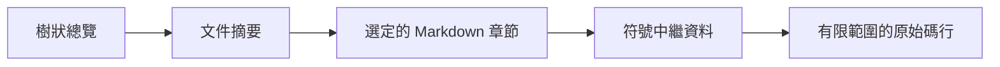

## 重點摘要 {#tl-dr}

- 樹狀與文件查詢顯示摘要及可繼續閱讀的步驟。
- 章節查詢保留 Markdown；符號與原始碼查詢提供實作證據。
- 分頁讓大量結果易於瀏覽，新鮮度檢查避免將舊行範圍與新程式碼混用。

## 理解模型 {#mental-model}

## 核心概念 {#concepts}

### 一次展開一層 {#disclosure}

`query tree` 回傳含摘要的階層項目。`query doc <id>` 回傳單頁摘要、父頁、子頁與章節大綱。`query section <id>` 回傳原始 Markdown 與實作位置。`query file <path>` 在有已記錄注意事項時優先顯示。搜尋涵蓋頁面摘要、章節主體與原始碼符號。`--json` 為 LLM 工具提供結構化回應；文字輸出則向人類呈現相同閱讀選擇。

樹狀檢視在每一層依索引文件順序排列。它與 HTML 側邊欄不同，不會將手冊根頁移到架構前方，也不會把產生的總覽連結當成文件。兩種介面的頁面 ID 與父子關係相同；使用端應依 ID 操作，不應假設頁面位置一致。

### 符號是可定址的原始碼證據 {#symbols}

`query symbol <name>` 回傳宣告中繼資料。`query source <name>` 從工作目錄讀取索引中的宣告。精確 ID 或檔案限定名稱可解決歧義。`--limit` 與 `--offset` 對結果或文字行分頁；`next_offset` 表示還有內容。結果數或行數限制不是嚴格 token 預算，特別大的項目仍可能需要客戶端限制。

### 信任位置前先檢查新鮮度 {#freshness}

索引記錄設定、Markdown、掃描的原始碼、明確擁有／參照的資產、審查紀錄與主題輸入的 SHA-256 指紋。查詢將目前輸入與建置快照比較，包含新增與刪除檔案。即使時間戳無法反映變更，內容改變仍會將索引標為過期。原始碼查詢要求目前有效的索引，因為舊行範圍無法可靠識別編輯後的宣告。請先用 `codewiki build --strict` 重建。Markdown 查詢仍可回傳索引中的說明，但會明確顯示過期狀態。

## 文件審查狀態 {#documentation-review-status}

文件摘要提供精簡的 `review`，包含建置時的狀態與理由。它與作者設定的 stable／draft 狀態及索引新鮮度分開。使用 `codewiki review status --json` 檢查即時輸入與詳細的新舊雜湊；`codewiki review check` 不依賴索引，執行 CI 關卡。

## 索引相容性 {#index-compatibility}

查詢回應與索引都包含結構版本。舊嵌入式索引必須使用已安裝框架重新建置，才能使用漸進式查詢；CLI 會明確提示，不會顯示空的章節大綱。

## 沿著架構圖閱讀 {#follow-the-architecture-graph}

文件摘要在 JSON 與文字輸出中都包含 `depends_on`、反向 `used_by` 與 `diagram_links`，呈現與 HTML 圖相同的作者定義關係。請查詢目的文件或章節，而非載入整個 Wiki。缺少這些選用欄位的舊 schema-v1 索引仍可載入；重新建置即可補上。
