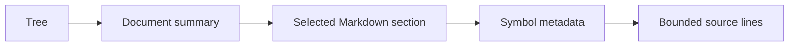

## TL;DR

- Tree and document queries reveal summaries and available next steps.
- Section queries preserve Markdown; symbol and source queries reveal implementation evidence.
- Pagination keeps large result sets navigable, and freshness prevents mixing old ranges with new code.

## Mental Model

## Concepts

### Reveal one level at a time {#disclosure}

`query tree` returns hierarchy entries with summaries. `query doc <id>` returns
one page's summary, parent, children, and section outline. `query section <id>`
returns original Markdown and implementation locations. `query file <path>`
starts with documented hazards when available. Search spans page summaries,
section bodies, and source symbols. `--json` supplies a structured envelope for
LLM tools; text output gives the same reading choices to a person.

### Symbols are addressable source evidence {#symbols}

`query symbol <name>` returns declaration metadata. `query source <name>` reads
the indexed declaration from the checkout. Exact IDs or file-qualified names
resolve ambiguity. `--limit` and `--offset` paginate results or text lines;
`next_offset` indicates more content. A result-count or line limit is not a
strict token budget; unusually large items may still require client-side limits.

### Check freshness before trusting locations {#freshness}

The index records SHA-256 fingerprints of configuration, Markdown, scanned source,
and theme inputs. Queries compare current inputs with the build snapshot, including
added or deleted files. A changed file marks the index stale, even if a new timestamp
would otherwise obscure the change. Source queries require a current index, because
old line ranges cannot safely identify declarations in edited source. Rebuild using
`codewiki build --strict` before continuing. Markdown queries can still reveal the
indexed explanation, with a visible stale status.

## Index Compatibility

The query envelope and index carry a schema version. Older embedded indexes must
be rebuilt with the installed framework before progressive queries are available;
the CLI reports this explicitly instead of presenting an empty section outline.

## Follow the architecture graph

Document summaries include `depends_on`, reverse `used_by`, and `diagram_links` in
both the JSON envelope and text output. These fields expose the same authored
relationships as the HTML map. Query the destination document or section rather
than loading the entire wiki. Older schema-v1 indexes without these optional
fields still load; rebuild to include them.
