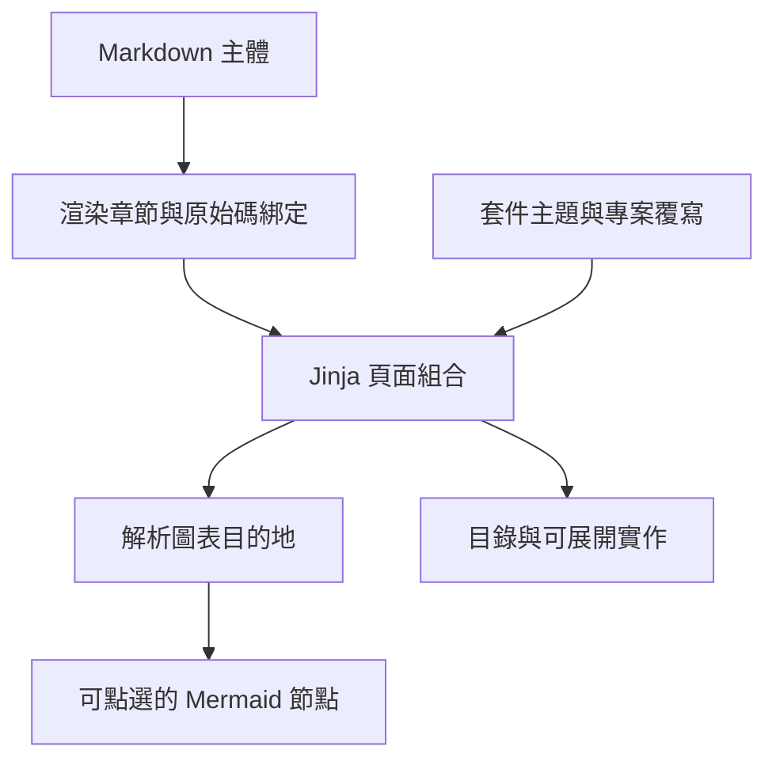

## 從模型到頁面 {#inside-the-renderer}

藍色連結節點開啟另一個元件，綠色連結節點開啟章節。同一頁可作為靜態 HTML 使用；JavaScript 增強圖表與閱讀工具。

## Markdown 轉為章節 {#markdown}

`render_body()` 將 Mermaid 區塊與一般 Markdown 分開。Markdown 轉成 HTML；圖表保持為已跳脫的原始內容，直到瀏覽器使用隨附 Mermaid 函式庫渲染。每個章節依 Markdown 順序只輸出一次。標題 ID 成為穩定目的地，帶標籤的宣告直接顯示在說明下方。

## 組合與發佈頁面 {#publication}

`render_site()` 優先從專案的 `wiki/_theme/` 載入 Jinja 範本，再回退到套件預設值。`_base.html.j2` 負責共用導覽與外框；`page.html.j2` 負責章節、相依關係、元件卡片、圖表與原始碼面板。`index.html.j2` 與 `files.html.j2` 提供總覽及檔案查找。

沒有父頁的頁面在側邊欄與總覽卡片中是獨立根頁。兩處都將手冊根頁排在其他根頁之前，各群組內維持原順序。側邊欄以連到 `index.html` 的總覽連結開始；瀏覽總覽時會標示目前位置，且該連結也參與頁名搜尋。`type: manual` 的根頁使用真實頁面階層顯示閱讀路徑，因此手冊與後代不顯示架構閱讀步驟；架構頁仍使用「架構 → 元件 → 實作」路徑。

CSS 提供響應式配置、圖表畫布與閱讀深度提示。沒有客戶端應用程式路由器或正式環境應用伺服器。輸出包含本地 Mermaid 與語法醒目提示資產，可由任何靜態主機提供。

預設總覽也列出待處理文件審查。各頁將審查狀態及上次理由與作者的 `status`（例如 stable 或 draft）分開呈現。這些是建置時的結果；即時審查 API 讀取目前檔案。自訂主題必須明確加入這些面板。

## 解析圖表連結 {#navigation}

`diagram_targets()` 依下列優先規則解析節點名稱：

1. 符合文件 ID 的節點連到該元件頁。
2. 符合本頁標題 slug 的節點連到該章節。
3. 明確的 `diagram_links` 項目覆寫自動比對。

例如上圖的 `navigation` 節點指向這裡。作者也可將簡短節點名稱對應到 `documents.validation`，連到另一頁的章節。建置會驗證明確目的地，不會根據節點位置或原始碼標籤推論執行時相依；這些關係由作者宣告。

## 瀏覽器行為 {#diagrams}

`diagrams.js` 渲染每個圖表，並將符合的節點包入真正的 SVG 連結。連結支援鍵盤焦點、一般導覽、複製目的地與另開分頁。展開按鈕放大畫布；Escape 關閉。每個具有明確對應的圖表下方，都有一般目的地清單；圖表無法渲染或讀者偏好文字時，可沿相同路徑閱讀。

## 閱讀與原始碼證據 {#reading}

側邊欄以巢狀原生 `details` 群組呈現父頁，摘要內保留獨立頁面連結。目前頁面與祖先預設展開，其餘群組預設收合。個別群組不需要 JavaScript。渲染器也保留供自訂主題使用的平面 `nav` 資料契約。

`render_site()` 提供含 `id`、`title`、`out`、`depth` 與 `children` 的 `nav_tree` 節點；`_base.html.j2` 遞迴渲染。總覽與原始碼索引沒有目前文件分支，因此群組預設關閉。展開狀態只屬於目前頁面；導覽或重新載入時使用下一頁產生的預設值，不儲存展開偏好。

`reading.js` 加入全部展開／收合控制及文件樹篩選，顯示符合項目的祖先，清除搜尋時恢復搜尋前狀態。搜尋會去除首尾空白、不分大小寫，且要求每個以空白分隔的詞都出現在頁面標題。父頁標題符合不會自動顯示不符合的子頁。搜尋期間停用全部群組控制。初次載入寬度不超過 760 像素時，腳本會收合外層「瀏覽文件」面板；讀者可開啟它以存取同一棵樹。

腳本追蹤目錄中可見章節，並在程式碼可見時載入語法醒目提示。原生 `details` 將實作主體保持關閉，直到讀者要求展開；檔案路徑與行範圍標明原始碼證據。檔案責任連結使用設定的編輯器開啟，也適用於未作為標籤語言剖析的 Jinja、CSS、JavaScript 與 Markdown 資產。

HTML 包含不超過設定行數的宣告片段。需要新鮮度檢查的分頁原始碼擷取請用 `query source`。Markdown 與 Mermaid 是受信任的專案內容，因此內嵌 HTML 由專案作者控制。

## HTML 翻譯 {#translations}

在英文頁旁新增 `renderer-ch_tw.md` 之類的同層檔案。區域後綴 `-ll_rr.md` 選擇 HTML 語言；`ch_tw` 與 `zh_tw` 都表示台灣繁體中文，輸出後綴為 `-ch_tw.html`，HTML 語言為 `zh-TW`。其他區域後綴（例如 `ja_jp`）產生額外語言選項；沒有介面翻譯目錄時，介面文字回退為英文。

翻譯保留英文 frontmatter 的 `id`，以及所有標題的層級、順序與錨點。翻譯標題請明確指定 `{#english-slug}`，包含英文中原本隱含的標題。可翻譯 `title`、`summary`、正文及選用的決策理由。關係、檔案責任、參照、原始碼片段與審查狀態繼承自英文。無效同層檔案、ID／標題不符與重複語言別名，都會使嚴格發佈失敗。

渲染器輸出各語言的總覽、檔案索引與文件頁。語言連結可離線使用，不需要 JavaScript。頁面導覽、相依關係、圖表連結，以及一般標準 `.html` 或相對 `.md` 連結，都維持所選語言。尚未翻譯的頁面會顯示英文內容與明確備援提示。切換語言會開啟對應頁面，明確章節錨點保持穩定。

只有英文進入分析、審查與 CLI 文件索引，因此技能繼續閱讀英文。翻譯檔案仍參與建置新鮮度與預覽。移除翻譯後，`rendered_pages` 清單用於清理過期語言頁。自訂範本可使用 `locale`、`html_lang`、`page_url`、`tr` 與 `language_options`；覆寫預設外框時，必須自行加入語言切換器。
