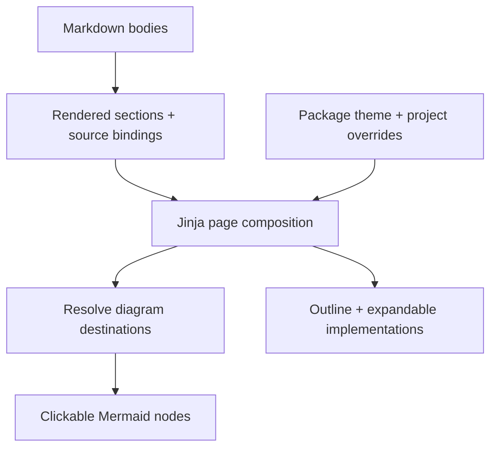

## Inside the renderer

The renderer turns the shared document model into static pages, a collapsible
project tree, linked diagrams, and expandable source panels. Browser scripts add
search and reading controls to the generated HTML.

The [Build orchestrator](build.html#orchestration) calls `render_site()` with the
assembled model. Rendering is one stage of the [complete build pipeline](build.html#inside-the-pipeline);
the orchestrator publishes the resulting staged files. **Used by: Build pipeline**
is the document-level link to that coordinating caller's guide.

Blue linked nodes open another component; green linked nodes open a section.
The same page works as static HTML. JavaScript enhances diagrams and reading tools.

## Markdown to sections {#markdown}

`render_body()` separates Mermaid fences from ordinary Markdown. Markdown becomes
HTML; diagrams remain escaped source until the browser renders them with the vendored
Mermaid library. Each section is emitted once, in Markdown order. Heading IDs become
stable destinations, and tagged declarations appear directly below their explanation.

## Compose and publish pages {#publication}

`render_site()` loads Jinja templates from the project's `wiki/_theme/` first, then
falls back to packaged defaults. `_base.html.j2` owns the shared navigation and shell;
`page.html.j2` owns document sections, dependencies, component cards, diagrams, and
source panels. `index.html.j2` and `files.html.j2` provide overview and file lookup.

Pages with no parent are independent roots in the sidebar and Overview cards.
Manual roots appear before other roots in both places, preserving existing order
within each group. The sidebar starts with an Overview link to `index.html`, which
is highlighted when viewing the overview and participates in page-title search.
A root with `type: manual` uses its actual page hierarchy for the reading path,
so a user manual and its descendants do not display architecture reading steps.
Architecture pages retain the Architecture → Component → Implementation path.

CSS provides the responsive layout, diagram canvas, and reading-depth cues. There
is no client-side app router or production application server. Output includes
local Mermaid and syntax-highlighting assets and can be served by any static host.

The default overview also lists pending documentation reviews. Each document
shows its review state and previous reason separately from its authored `status`
(such as stable or draft). These are build-time results; the live review API reads
current files. Custom theme overrides must adopt these panels explicitly.

## Resolve diagram links {#navigation}

`diagram_targets()` resolves node names using this precedence:

1. A node matching a document ID links to that component page.
2. A node matching a heading slug on this page links to that section.
3. An explicit `diagram_links` entry overrides either automatic match.

For example, the `navigation` node above points here. An author can also map a
short node name to `documents.validation` to cross into another page's section.
The build validates explicit destinations. It does not infer runtime dependencies
from node positions or source tags; authors declare those relationships.

## Browser behavior {#diagrams}

`diagrams.js` renders each diagram and wraps matching nodes in real SVG links.
Links support keyboard focus, normal navigation, copying the destination, and
opening another tab. The expand button enlarges the canvas; Escape closes it.
A plain destination list below each explicitly mapped diagram offers the same path
when diagrams fail to render or a reader prefers text.

## Reading and source evidence {#reading}

The sidebar renders nested native `details` groups for parent pages, with separate
page links in their summaries. The current page and its ancestors start expanded;
other groups start collapsed. Individual groups work without JavaScript. The
renderer also retains the flat `nav` data contract for custom theme overrides.

`render_site()` supplies `nav_tree` nodes with `id`, `title`, `out`, `depth`, and
`children`; `_base.html.j2` renders them recursively. Overview and Source index
have no current document branch, so their groups start closed. Expansion is
local to the open page: navigating or reloading uses the next page's generated
defaults, with no saved expansion preference.

`reading.js` adds expand/collapse-all controls and filters the document tree,
revealing ancestors of matches and restoring pre-search expansion when cleared.
Search trims the query, ignores case, and requires every whitespace-separated
word to occur in a page title. Matching a parent title does not automatically
show its nonmatching children. The all-group controls are disabled during search.
On initial loads at widths of 760 pixels or less, the script closes the outer
Browse documentation panel; readers can open it to reach the same tree.
It tracks the visible section in the outline,
and loads syntax highlighting when code is visible. Native `details` elements keep
implementation bodies closed until requested; file paths and line ranges identify
the source evidence. File ownership links open the configured editor, including
Jinja, CSS, JavaScript, and Markdown assets which are not parsed as tagged languages.

The HTML includes declaration snippets up to the configured build limit. Use
`query source` for paginated source retrieval with freshness checking. Markdown and
Mermaid are trusted project content, so project authors control embedded HTML.
