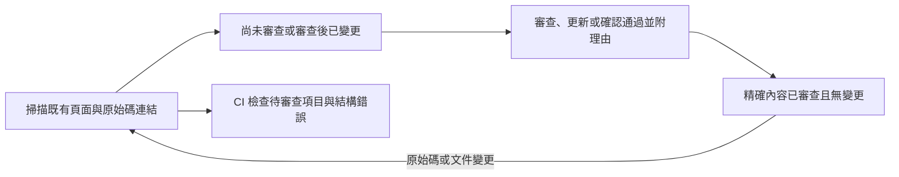

## 重點摘要 {#tl-dr}

- 目前原始碼與 Markdown 會和明確的審查紀錄比較，不使用 Git 日期判斷。
- 重新建置更新網站與索引，永遠不會代為確認文件審查。
- 只有既有頁面與其宣告的原始碼涵蓋範圍參與；未涵蓋程式碼不要求新增頁面。

## 審查生命週期 {#review-lifecycle}

## 即時狀態 API {#status}

`codewiki.review.report(w)` 接受已載入的 `Wiki`，回傳 JSON 相容報告，包含 `schema_version`、`ok`、`pending`、`total`、`errors` 與 `documents`。它呼叫共用 `build.analyze()` 管線，不讀取或發佈索引。每份文件包含 ID、標題、路徑、狀態、理由、目前 `snapshot`、`fingerprint`、先前審查紀錄與 `changes`。

| 狀態 | 意義 |
| --- | --- |
| `unreviewed` | 此頁尚無明確基準。 |
| `outdated` | 文件內容、路徑、原始碼內容或涵蓋範圍與已確認版本不同。 |
| `current` | 目前輸入符合已確認版本。 |

Outdated 是審查請求，不是語意判斷。目前採用整份檔案的 SHA-256 雜湊，因此涵蓋檔案中的無關編輯也可能要求審查。`owns` 包含 CSS 等資產；`refs` 涵蓋無法加標籤的宣告；原始碼標籤將檔案連到頁面的明確錨點。涵蓋清單記錄這些關係。審查紀錄保留先前範圍，因此移除標籤或移動檔案不會默默清除審查請求。關聯移除時，目前原始碼雜湊為 null，代表它離開涵蓋範圍，不一定代表實體檔案已刪除。

純文件頁面也需要初次審查，Markdown 改變後會過期。無關原始碼檔案的變更不影響審查。架構 `depends_on` 不推論傳遞性的執行時相依；必要原始碼需明確連結。報告與各頁上一次確認比較，不是與 PR 基準分支或自動推論的語意差異比較。

## 確認精確內容 {#acknowledge}

`codewiki.review.acknowledge(w, document, outcome=..., reason=..., expected=...)` 接受 `updated`、`no-change` 或 `retired`。每種結果都需要非空理由。選用的 `expected` 防止呼叫者檢查狀態後又出現變更；審查技能會使用它。已有紀錄時，`updated` 要求 Markdown 確實改變。Pass 可在不修改文字的情況下建立初次基準。兩者都無法自動證明語意正確。

單筆紀錄以原子方式寫入設定檔旁的 `reviews/<document-id>.json`，包含時間、理由、結果、供參考的 Git HEAD、內容雜湊、涵蓋範圍與確定性指紋。請將紀錄與原專案的原始碼及頁面一同提交。Git 保存先前紀錄，不使用獨立資料庫或版本控制服務。只有 Git HEAD 不足以識別已審查版本；雜湊也涵蓋未提交內容。

刪除頁面後，只要最後一份有效紀錄仍存在，就維持待處理狀態。修復孤立標籤與頁面連結後，使用附理由的 `retire`。還原已退役 ID 需要重新確認。格式錯誤的紀錄是錯誤，不是缺少基準。編輯或刪除審查紀錄應納入一般 PR 審查；紀錄是聲明，不是誰檢查程式碼的密碼學證明。獨立核准及防止刻意同時刪除頁面與紀錄，都由儲存庫政策負責。

## CI 與 Hook {#ci}

Python 報告的 `ok` 只有在沒有待處理頁面及結構／剖析錯誤時才為 true。CLI 透過 `codewiki review check` 提供這個契約：

| 結束碼 | 意義 |
| --- | --- |
| 0 | 審查檢查通過；有效報告即使有待處理頁面，`status` 也回傳 0。 |
| 1 | `check` 找到尚未審查或審查後已變更的未解決文件。 |
| 2 | 輸入、紀錄、設定無效，或結構／剖析失敗。 |

另行執行 `codewiki build --strict` 驗證發佈與範本。審查通過不能豁免結構錯誤。剖析失敗會阻擋審查確認／檢查，即使建置器通常將它視為警告。`--json` 將相同報告提供給代理 hook 與 CI；`--outdated` 將列出的文件篩選為所有待處理狀態，但保留完整計數與錯誤。

初始化將選用整合範例複製到 `integrations/`。Shell 檢查與 pre-push 範例使用目前環境的 `codewiki` 命令。它們檢查目前工作目錄，不是 Git 暫存區或多 ref 推送中的每個 ref。CI 應針對被檢查修訂版本的乾淨工作目錄執行。不會自動安裝 hook 或修改遠端分支規則。

## 驗證 {#tests}

`tests/test_review.py` 涵蓋審查生命週期、重建獨立性、原始碼與 Markdown 變更、無變更確認、未涵蓋程式碼不受影響、擁有的資產、參照、移除／移動標籤、刪除頁面、過期 expected 指紋、格式錯誤紀錄、剖析失敗、不依時間戳的偵測、精簡查詢狀態、未涵蓋頁面隔離、CLI 結束碼，以及初始化／預覽整合。它不驗證人類或代理所填理由是否真實。
