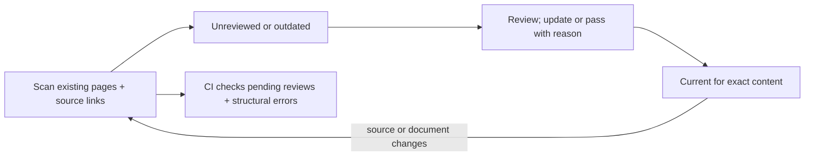

## TL;DR

- Current source and Markdown are compared with explicit review records, not Git dates.
- Rebuilding updates the site and index; it never acknowledges a documentation review.
- Only existing pages and their declared source coverage participate. Uncovered code does not require a new page.

## Review lifecycle

## Live status API {#status}

`codewiki.review.report(w)` accepts a loaded `Wiki` and returns a JSON-compatible
report with `schema_version`, `ok`, `pending`, `total`, `errors`, and `documents`.
It calls the shared `build.analyze()` pipeline without reading or publishing an
index. Every document includes its ID, title, path, state, reason, current
`snapshot`, `fingerprint`, previous review record, and `changes`.

| State | Meaning |
| --- | --- |
| `unreviewed` | No explicit baseline exists for this page. |
| `outdated` | Document content, path, source content, or coverage differs from the acknowledged version. |
| `current` | Current inputs match the acknowledged version. |

Outdated is a review request, not a semantic judgment. Whole-file SHA-256 hashes
are used initially: an unrelated edit in a covered file can request review.
`owns` includes assets such as CSS; `refs` covers untaggable declarations; source
tags attach a file to a page's explicit anchors. The coverage list records these
relationships. Prior coverage is retained in review records, so removing a tag or
moving its file cannot silently clear the review request. A removed association
has a null current source hash; that means it left coverage, not necessarily that
the physical file was deleted.

Document-only pages also receive an initial review and become outdated when their
Markdown changes. Changes to unrelated source files do not invalidate reviews.
Architectural `depends_on` links do not infer transitive runtime dependencies;
link required source explicitly. The report compares against each page's last
acknowledgment, not a PR base branch or an automatically inferred semantic diff.

## Acknowledge exact content {#acknowledge}

`codewiki.review.acknowledge(w, document, outcome=..., reason=..., expected=...)`
accepts `updated`, `no-change`, or `retired`. Every outcome requires a nonempty
reason. `expected` optionally guards against changes since the caller inspected
status; the review skill uses it. An `updated` outcome requires changed Markdown
when a previous record exists. A pass can establish the first baseline without
changing prose. Neither operation proves semantic correctness automatically.

One record is atomically written to `reviews/<document-id>.json` next to the
configuration. It contains a timestamp, reason, outcome, informational Git HEAD,
content hashes, coverage, and a deterministic fingerprint. Commit these records
with source and pages in the original project. Git preserves earlier records;
there is no separate database or version-control service. Git HEAD alone is not
the reviewed version: hashes also identify uncommitted content.

A removed page remains pending while its last active record exists. Use `retire`
with a reason after repairing orphaned tags and page links. Restoring a retired ID
requires a fresh acknowledgment. Malformed records are errors, not missing
baselines. Review record edits and deletions belong in ordinary PR review; records
are attestations, not cryptographic proof of who inspected the code. Independent
approval and protection against deliberate removal of both pages and records are
repository policy responsibilities.

## CI and hooks {#ci}

The Python report's `ok` is true only with no pending pages and no structural or
parser errors. The CLI exposes that contract through `codewiki review check`:

| Exit | Meaning |
| --- | --- |
| 0 | Review check passes. `status` also returns 0 for a valid report with pending pages. |
| 1 | `check` found unresolved unreviewed or outdated documents. |
| 2 | Invalid inputs, records, configuration, structural errors, or parser failures. |

Run `codewiki build --strict` separately to validate publication and templates.
A review pass cannot waive structural failures. Parser failures block review
acknowledgments/checks even though the builder normally treats them as warnings.
`--json` gives the same report to agent hooks and CI; `--outdated` filters the
listed documents to all pending states, retaining full counts and errors.

Initialization copies optional integration examples into `integrations/`. The
shell check and pre-push example use the active environment's `codewiki` command.
They inspect the current working tree, not Git's staging area or every ref in a
multi-ref push. CI should run on a clean checkout of the revision being checked.
No hook is installed and no remote branch rule is changed automatically.

## Verification {#tests}

`tests/test_review.py` exercises review lifecycle, rebuild independence, source and
Markdown changes, no-change acknowledgments, untouched uncovered code, owned
assets, references, removed/moved tags, deleted pages, stale expected fingerprints,
malformed records, parser failures, timestamp-independent detection, compact query
status, uncovered-page isolation, CLI exit codes, and initialization/preview
integration. It does not validate the truthfulness of a human or agent's reason.
