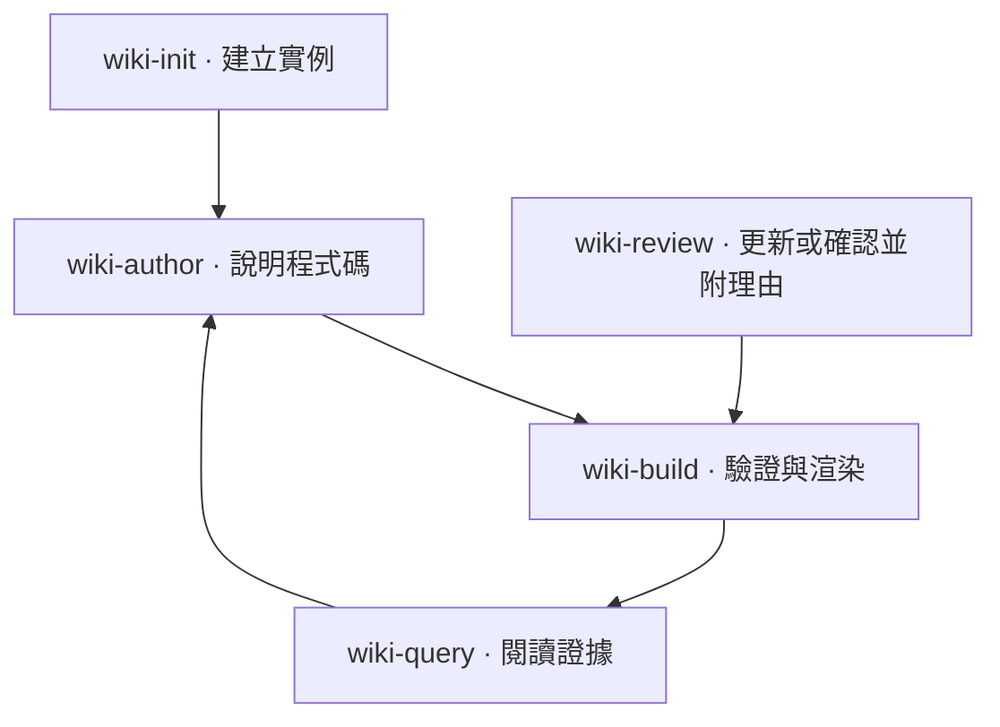

## 技能流程 {#skill-workflows}



箭頭描述撰寫工作流程，不是 Python 匯入關係。技能是由 LLM 客戶端載入的 Markdown 指示，不在渲染器內執行。

## 初始化 {#init}

`wiki-init/SKILL.md` 指示工具檢查儲存庫配置、選擇真實的原始碼根目錄、執行 `codewiki init`，並用觀察到的事實取代起始內容。初始化程式將這些可攜式技能複製到專案實例；請以所選客戶端自己的探索機制註冊。初始化也會在專案根目錄的 `AGENTS.md` 加入帶標記的實例指南參照，保留既有指示，並避免重複執行時加入相同區段。技能應確認此整合結果，不需再手動加入另一份根目錄參照。

## 漸進式閱讀 {#query}

`wiki-query/SKILL.md` 從樹狀或檔案查詢開始，先展開文件摘要，再讀所選章節，最後才讀相關符號與原始碼。CLI 的 `--json` 形式以識別碼提供相依關係與圖表目的地，因此 LLM 不需剖析渲染 HTML，就能沿同一張元件圖閱讀。

```text
codewiki query tree
codewiki query doc renderer
codewiki query section renderer.navigation
codewiki query symbol codewiki.build.diagram_targets
codewiki query source codewiki.build.diagram_targets --limit 40
```

每個結果都回報新鮮度。信任原始碼行範圍前，先重建過期索引。查詢分頁控制項目或行數，不保證 token 預算。

## 依證據撰寫 {#author}

`wiki-author/SKILL.md` 要求作者先讀原始碼再說明行為、選擇穩定 ID、定義檔案責任，並以標籤或 refs 綁定重要概念。高層元件圖是作者撰寫的說明；`depends_on` 關係與 `diagram_links` 應和說明在同一次 Markdown 變更中維護。

## 驗證結果 {#check}

`wiki-build/SKILL.md` 執行嚴格驗證、修復失效連結，再檢查閱讀路徑。原始碼宣告與圖表目的地必須符合發佈頁面。建置成功驗證結構與綁定；人類或 LLM 仍需評估文字是否正確描述行為。

## 審查既有頁面 {#review}

`wiki-review/SKILL.md` 讀取即時 JSON 審查報告、檢查受影響頁面與原始碼、必要時更新說明，並為更新或無變更確認記錄具體理由。它使用報告指紋，拒絕在中途已有變更時仍沿用舊檢查的確認。新基準必須經過檢查；建置成功或無關原始碼編輯，都不能作為全面通過的理由。

## 整合界線 {#integration-boundary}

隨附指示呼叫已安裝的 CLI，v1 沒有 MCP 伺服器。更新套件中的技能不會覆寫已客製化的實例副本；維護既有專案時，請明確比較並採納變更。
