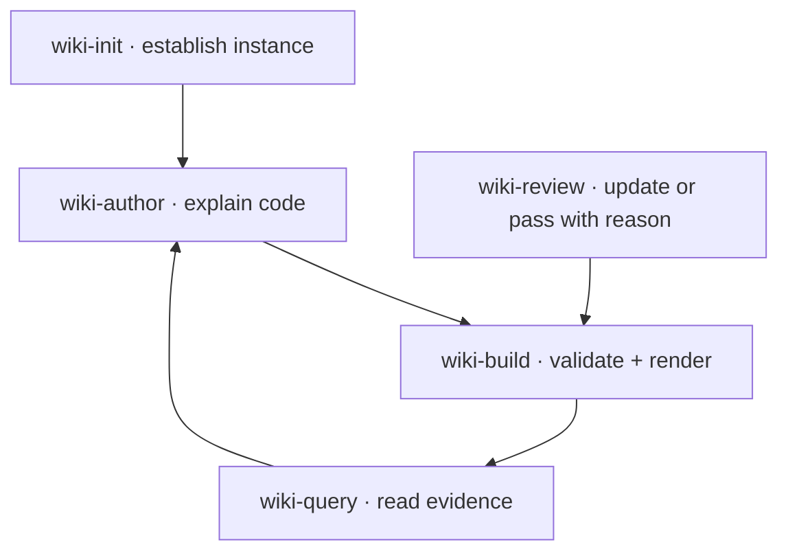

## Skill workflows



These arrows describe an authoring workflow, not Python imports. Skills are Markdown
instructions loaded by an LLM client; they do not run inside the renderer.

## Initialize {#init}

`wiki-init/SKILL.md` directs the tool to inspect the repository layout, choose real
source roots, run `codewiki init`, and replace starter claims with observed facts.
The initializer copies these portable skills into the project instance; register
them using the chosen client's own discovery mechanism. Initialization also adds
a marked reference to the instance guide in the project-root `AGENTS.md`, preserving
existing instructions and avoiding duplicates on repeat runs. The skill verifies
this integration instead of manually adding another root reference.

## Read progressively {#query}

`wiki-query/SKILL.md` starts with the tree or a file query. It expands a document
summary, then a selected section, and only then the relevant symbols and source.
The CLI's `--json` form exposes dependencies and diagram destinations as identifiers,
so an LLM follows the same component graph without parsing rendered HTML.

```text
codewiki query tree
codewiki query doc renderer
codewiki query section renderer.navigation
codewiki query symbol codewiki.build.diagram_targets
codewiki query source codewiki.build.diagram_targets --limit 40
```

Each result reports freshness. Rebuild a stale index before trusting source ranges.
Queries paginate results; this controls items or lines rather than guaranteeing a
token budget.

## Author with evidence {#author}

`wiki-author/SKILL.md` asks authors to read source before explaining behavior,
choose stable IDs, define ownership, and bind important concepts with tags or refs.
A high-level component diagram is an authored explanation. Keep its `depends_on`
relationships and `diagram_links` in the same Markdown change as the explanation.

## Validate the result {#check}

`wiki-build/SKILL.md` runs strict validation, resolves broken links, then checks the
reading path. Source declarations and diagram destinations must agree with the
published page. A successful build verifies structure and bindings; a human or LLM
still needs to assess whether the prose accurately describes behavior.

## Review existing pages {#review}

`wiki-review/SKILL.md` reads the live JSON review report, inspects each affected
page and its source, updates explanations when required, and records a specific
reason for either an update or a no-change pass. It uses the report fingerprint
to reject acknowledgments based on intervening changes. New baselines require
inspection; neither a build nor an unrelated source edit warrants a blanket pass.

## Integration boundary

The shipped instructions call the installed CLI. There is no MCP server in v1.
Updating packaged skills does not overwrite customized instance copies; compare
and adopt changes explicitly when maintaining an existing project.
