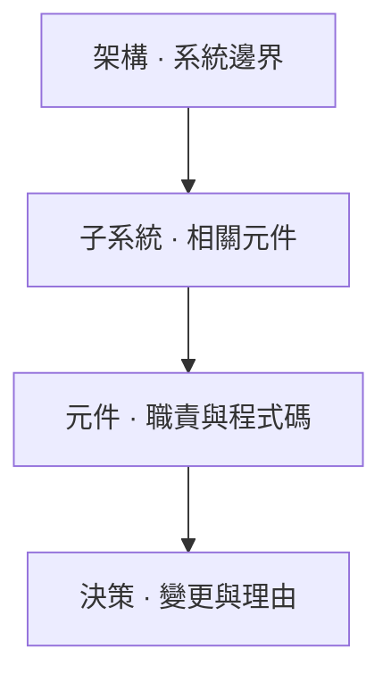

## 從總覽到實作 {#from-overview-to-implementation}



這些是文件角色，不是必要的目錄層級。小型專案可由架構直接連到元件。`parent` 控制導覽，與 Markdown 檔案的位置無關。

## 架構範本 {#architecture}

`templates/architecture.md` 從系統模型、進入點與主要限制開始。請用代表專案真實組成的節點圖取代起始內容。將節點對應到子文件，使總覽保持精簡。

## 子系統範本 {#subsystem}

`templates/subsystem.md` 以一項職責整理相關元件。架構圖過大難以閱讀時可使用它。描述輸入、輸出與順序限制，再將實作細節交給子頁。

## 元件範本 {#component}

`templates/component.md` 建立職責、流程、原始碼責任、重要限制與開放問題。以下範例宣告相依關係，並將總覽節點直接連到穩定的實作章節：

```yaml
id: parser
parent: architecture
depends_on: [configuration]
diagram_links:
  parse: parser.parse
  config: configuration
```

正文接著可包含 `parse` 節點與 `### Parse {#parse}` 標題。將 `@wiki:impl parser.parse` 直接放在實作宣告上方。建置後選擇節點，即可看到說明與其綁定程式碼。

## 決策範本 {#decision}

`templates/decision.md` 記錄作者提供的理由，以及選用的提交與 PR 參照。說明改變了什麼，以及證據如何支持決策；不知道的理由應明確標示。現有驗證檢查錨點目標與網址格式，不會抓取 PR 或驗證提交存在。

## 實例界線 {#instance-boundary}

`init_project.main()` 將範本複製到 `wiki/_templates/`，只有在尚無已撰寫頁面時才建立架構起始頁。底線開頭目錄中的檔案不參與 Wiki 建置。重複初始化保留既有檔案，因此本地範本可隨專案演進。
