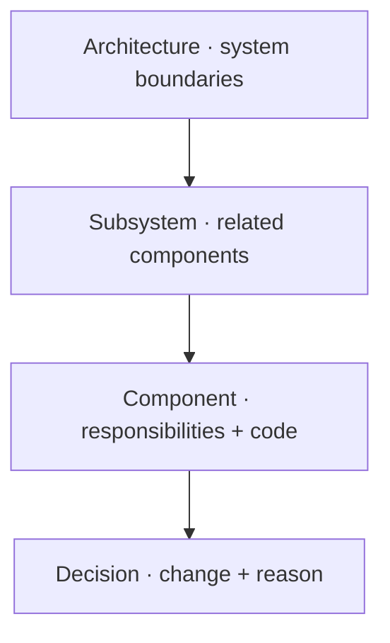

## From overview to implementation



These are document roles, not mandatory directory levels. A small project can link
its architecture directly to components. `parent` controls navigation independently
of where a Markdown file lives.

## Architecture template {#architecture}

`templates/architecture.md` starts with a system model, entry points, and primary
constraints. Replace the starter with a diagram whose nodes represent real parts
of the project. Map nodes to child documents so the overview stays concise.

## Subsystem template {#subsystem}

`templates/subsystem.md` groups components around one responsibility. Use it when
the architecture map has become too large to read. Describe inputs, outputs, and
ordering constraints, then delegate implementation detail to children.

## Component template {#component}

`templates/component.md` establishes a responsibility, flow, source ownership,
important constraints, and open questions. This example declares a dependency and
links an overview node directly to a stable implementation section:

```yaml
id: parser
parent: architecture
depends_on: [configuration]
diagram_links:
  parse: parser.parse
  config: configuration
```

The body can then contain a `parse` node and a heading `### Parse {#parse}`. Place
`@wiki:impl parser.parse` immediately above the implementing source declaration.
After building, selecting the node reveals the explanation and its bound code.

## Decision template {#decision}

`templates/decision.md` captures a supplied reason with optional commit and PR
references. Record what changed and why the evidence supports the decision. Keep
unknown reasons explicit. Current validation checks anchor targets and URL shape;
it does not fetch a PR or verify a commit exists.

## Instance boundary

`init_project.main()` copies templates to `wiki/_templates/` and only creates an
architecture starter when no authored pages exist. Files under underscore-prefixed
directories are excluded from the wiki build. Existing files survive repeated
initialization, so local templates can evolve with the project.
