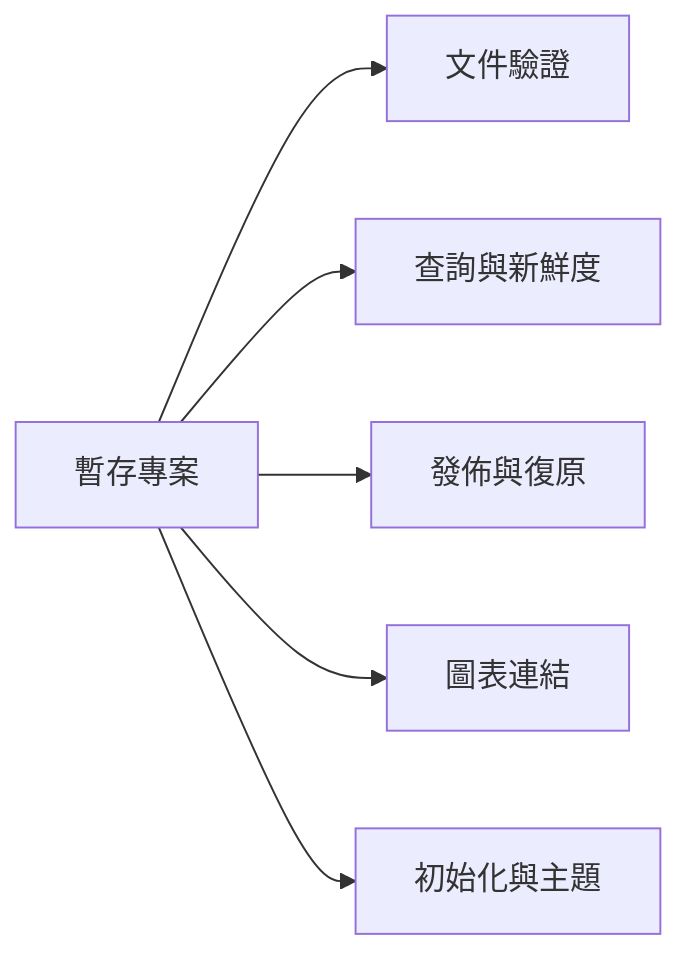

## 框架測試架構 {#framework-test-architecture}



箭頭描述共用測試 fixture，不是測試執行順序。每個案例建置或修改隔離專案，並檢查可觀察輸出。選擇領域閱讀斷言，再展開連結的測試原始碼。

## 執行這些檢查 {#run-these-checks}

```sh
.venv/bin/python -m pytest tests/test_framework.py -q
.venv/bin/python -m pytest tests/test_framework.py -k 'diagram or architecture' -q
```

## 暫存專案隔離整合測試 {#fixtures}

`instance` fixture 在 pytest 的 `tmp_path` 下建立原始碼目錄，寫入帶標籤的 Python 函式，初始化真正的 CodeWiki 實例，再用已知 Markdown 取代起始文件。巢狀標題、程式碼區塊、強調文字與連結，提供查詢應保留的具體內容。帶引號的專案名稱也驗證設定序列化。

`build()` 輔助函式以嚴格模式呼叫真正的建置器，失敗時附上診斷種類與訊息。各測試可修改自己的原始碼、文件或主題並重建，不影響本儲存庫已發佈的 Wiki。測試建立真實檔案，不模擬建置與查詢介面。

## 文件驗證拒絕錯誤結構 {#validation}

框架套件檢查缺少或格式錯誤的 frontmatter、不安全及保留 ID、欄位型別錯誤、父頁／相關頁／決策關係失效、階層循環與重複文件 ID。參數化讓每種錯誤輸入在 pytest 輸出中各自可見。

這些案例補充[文件驗證器](documents.html#validation)。結構驗證通過無法證明架構說明在語意上正確，仍需將文字與原始碼行為比較。

## 漸進式查詢保留證據 {#queries}

測試驗證文件摘要不會立即包含完整 Markdown，章節保留強調與巢狀子章節但不混入同層內容，程式碼區塊不會產生假標題，原始碼分頁回傳預期行數。

新鮮度測試編輯、新增與刪除原始碼檔案，確認過期範圍會被拒絕。其他案例檢查有歧義的基本檔名、JSON CLI 輸出、子命令前後的設定選項、未知符號錯誤，以及舊索引格式會明確要求重建。

## 發佈保留可用輸出 {#publication}

獨立手冊根頁 fixture 確認總覽與 CLI 導覽同時呈現手冊與架構，且子頁深度正確。手冊後代使用自己的閱讀路徑，包含中間頁；架構頁保留以實作為導向的既有路徑。所有頁面類型的側邊欄都以總覽開始，手冊排在架構前；總覽卡片也採用相同順序。

巢狀導覽 fixture 檢查總覽、原始碼索引、父頁與葉頁的原生展開群組。只有目前頁面分支與祖先預設展開，每頁保留連結，無關群組維持收合。

重複標題必須失敗，且不取代已儲存索引或渲染頁面。格式錯誤的 Jinja 範本必須保留先前輸出。移除文件再重建，必須清除對應的 HTML 頁面。

這些斷言觀察成功與失敗時的檔案狀態，不模擬同時閱讀者，也不證明整個網站發佈具原子性；限制請見[發佈界線](build.html#publication)。

## 架構導覽與 CLI 資料一致 {#diagrams}

圖表測試涵蓋未知頁面／章節目標、缺少的相依項目與中繼資料型別錯誤。嚴格建置失敗會保留先前索引。整合案例使用含點號 ID `engine.v2`，驗證精確查找、明確對應優先於本地 slug、自動文件連結與舊式本地章節連結；也檢查 CLI 中的正反向相依資料，以及 HTML 中的一般目的地連結。

另一項測試允許相依循環，同時維持父子階層無循環。這些檢查驗證產生的資料與 HTML，不執行 Mermaid 或瀏覽器點擊、鍵盤及展開對話框行為。

## 初始化與主題客製化得以保留 {#initialization}

重複初始化保留已撰寫 Markdown 與既有設定，將框架引擎留在實例之外，並複製可攜式技能。嘗試將實例目錄放在專案外會被拒絕。

階層／主題測試檢查子頁與分頁樹深度、專案 CSS 覆寫，以及套件 Mermaid 資產和授權檔是否存在。這是程序內的初始化／建置測試。從其他目錄驗證已建置 wheel 屬於額外的套件檢查。

## HTML 翻譯界線 {#translations}

翻譯 fixture 驗證繁體中文 HTML 與英文 CLI Markdown 並存、語言導覽與原始碼綁定、一般 Markdown／HTML 連結、外部網址與程式碼範例不變、備援提示、巢狀路徑、點號 ID 及各語言的圖表目的地。格式錯誤翻譯保留已發佈輸出，重複別名與輸出檔名衝突會失敗，多種語言保持獨立，刪除最後一份翻譯後會清除語言頁面。只修改翻譯不會改變標準英文文件的審查指紋。
