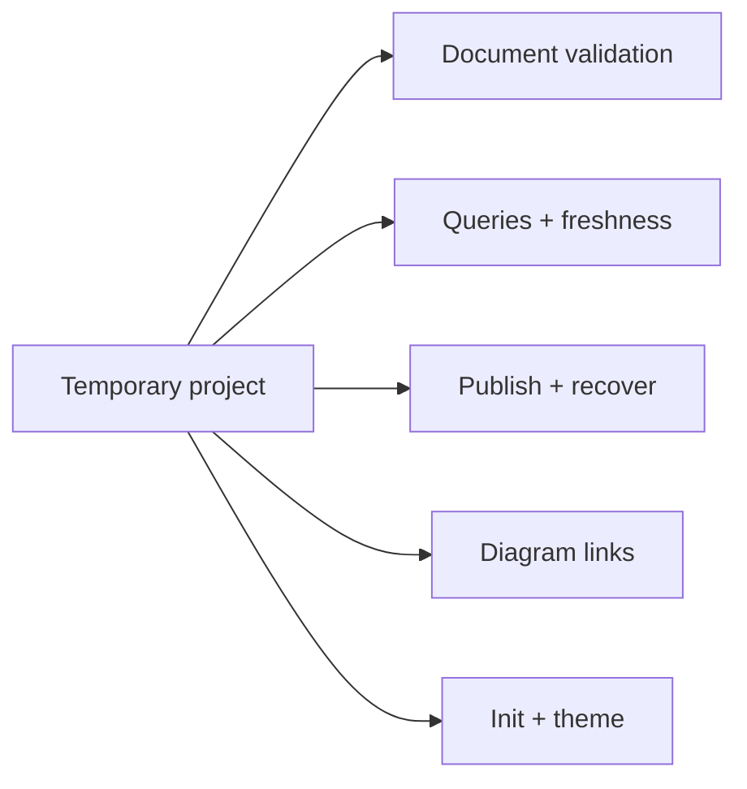

## Framework test architecture



Arrows describe the shared fixture, not test execution order. Each case builds or
modifies an isolated project and checks its observable output. Select an area to
read the assertions, then expand the linked test source.

## Run these checks

```sh
.venv/bin/python -m pytest tests/test_framework.py -q
.venv/bin/python -m pytest tests/test_framework.py -k 'diagram or architecture' -q
```

## Temporary projects isolate integration tests {#fixtures}

The `instance` fixture creates a source directory under pytest's `tmp_path`, writes
a tagged Python function, initializes a real CodeWiki instance, and replaces its
starter document with known Markdown. Its nested headings, code fence, emphasis,
and link give queries concrete content to preserve. The quoted project name also
exercises configuration serialization.

The `build()` helper calls the real builder in strict mode and includes diagnostic
kinds and messages when the build fails. Each test can change its own source,
document, or theme and rebuild without touching this repository's published wiki.
Tests construct actual files instead of mocking the build and query interfaces.

## Document validation rejects broken structure {#validation}

The framework suite checks missing or malformed frontmatter, unsafe and reserved
IDs, incorrect field types, broken parent/related/decision relationships, hierarchy
cycles, and duplicate document IDs. Parameterized cases make each malformed input
independently visible in pytest output.

These cases complement the [document validator](documents.html#validation).
A structural validation pass cannot establish that an architectural explanation
is semantically correct; that still requires comparing prose with source behavior.

## Progressive queries preserve evidence {#queries}

Tests verify that document summaries do not eagerly include full Markdown, a section
retains emphasis and nested subsections without leaking its siblings, fenced code
does not create false headings, and source pagination returns the expected lines.

Freshness tests edit, add, and delete source files and verify that stale source
ranges are rejected. Additional cases check ambiguous file basenames, JSON CLI
output, configuration options before and after subcommands, unknown-symbol errors,
and an explicit rebuild request for an old index format.

## Publication keeps usable outputs {#publication}

A separate manual-root fixture verifies that Overview and CLI navigation expose
the manual alongside architecture, with children at the correct depths. Manual
descendants use their own reading path, including intermediate pages; architecture
pages keep their existing implementation-oriented path.
The sidebar begins with Overview and places the manual before architecture on all
page types; the overview cards use the same manual-first order.

A nested navigation fixture checks native disclosure groups on overview, source
index, parent, and leaf pages. Only the current page's branch and ancestors start
open, every page keeps its link, and unrelated groups remain collapsed.

A duplicate heading must fail without replacing either the saved index or rendered
page. A malformed Jinja template must leave the previous outputs intact. Removing
a document and rebuilding must retire its generated HTML page.

These are observable file-state assertions around failure and success. They do not
simulate concurrent readers or prove that publishing the whole site is atomic;
see the [publication boundary](build.html#publication) for that limitation.

## Architecture navigation agrees with CLI data {#diagrams}

The diagram tests cover unknown page/section targets, missing dependencies, and
invalid metadata types. A failed strict build preserves the previously saved index.
The integration case uses a dotted document ID (`engine.v2`) to verify exact lookup,
explicit mapping precedence over a local slug, automatic document links, and legacy
local section links. It also checks dependency and reverse-dependency data in CLI
results and ordinary destination links in generated HTML.

A separate test allows dependency cycles while keeping the parent hierarchy acyclic.
These checks validate generated data and HTML. They do not execute Mermaid or the
browser's click, keyboard, or expanded-dialog behavior.

## Initialization and theme customization survive {#initialization}

Repeated initialization preserves authored Markdown and existing configuration,
keeps the framework engine outside the instance, and copies the portable skills.
An attempted instance directory outside the project is rejected.

The hierarchy/theme test checks a child page and paginated tree depth, a project CSS
override, and packaged Mermaid assets and license presence. This is an in-process
initialization/build test. Verifying a built wheel from an unrelated directory is
an additional packaging check.

## HTML translation boundaries {#translations}

Translation fixtures verify Traditional Chinese HTML alongside English CLI Markdown,
localized navigation and source bindings, ordinary Markdown/HTML links, unchanged
external URLs and code examples, fallback notices, nested paths, dotted IDs, and
localized diagram destinations. Malformed translations preserve published outputs;
duplicate aliases and output collisions fail, multiple locales remain independent,
and deleting the last translation retires localized pages. Translation-only edits
leave canonical review fingerprints unchanged.
