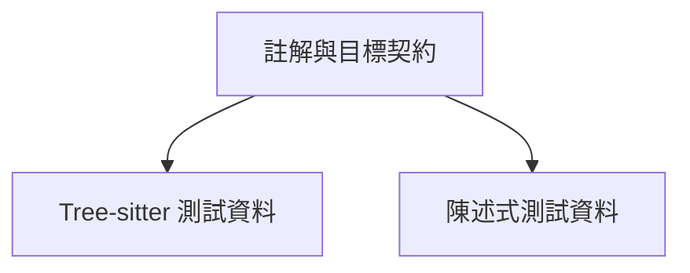

## 介面卡測試架構 {#adapter-test-architecture}



共用輔助函式掃描原始碼字串，提供錨點到宣告的對應。各分支對其語言測試資料的行為做斷言。選擇節點以檢視測試；Python 案例的原始碼雖位於 `test_framework.py`，仍包含在此處。

## 執行這些檢查 {#run-these-checks}

```sh
.venv/bin/python -m pytest tests/test_languages.py -q
.venv/bin/python -m pytest tests/test_framework.py -k python_decorators -q
```

## 註解與宣告綁定 {#binding}

`bound()` 呼叫選定語言掃描器，將剖析後的註解轉成錨點 ID 到符號名稱、種類與註記的對應。語言測試針對該對應與宣告目標做斷言。`test_parse_tag_comment_styles()` 檢查 C 風格、行註解、井字號與 shebang 風格的裝飾及註記擷取。

測試字串刻意包含 `k.fn` 等範例標籤；它們是測試輸入資料，不是此 Wiki 的文件錨點。Python 掃描器會辨識測試宣告上方真正的 `test-framework.*` 與 `test-languages.*` 註解，作為 Wiki 綁定。

## Tree-sitter 介面卡證據 {#parsers}

| 介面卡 | 驗證的斷言 |
| --- | --- |
| C | 巨集、typedef、列舉、變數、函式、條件保護宣告、原型分類與頂層篩選 |
| YAML | 對應鍵、清單項目與巢狀限定路徑 |
| Devicetree | 節點、參照、屬性、巨集、限定路徑與附加註記 |
| Python | 帶裝飾器的方法、限定名稱、非同步函式、註解群組，以及包含裝飾器的位元組範圍 |

C、YAML 與 devicetree 案例位於 `test_languages.py`；Python 案例位於 `test_framework.py`。測試確立所提供資料的行為，不證明完整文法涵蓋，也不推論執行時呼叫關係。

## 陳述式掃描器邊界 {#statements}

設定與建置語言測試涵蓋 `.conf` 賦值與取消設定、Make 變數／規則／條件、Kconfig 選項、CMake 命令，以及 shell 函式與賦值。Make 檢查續行規則包含 recipe 行；Kconfig 檢查選項說明區塊的邊界；shell 檢查函式最後一行。這些斷言保護讀者看到的原始碼範圍。
