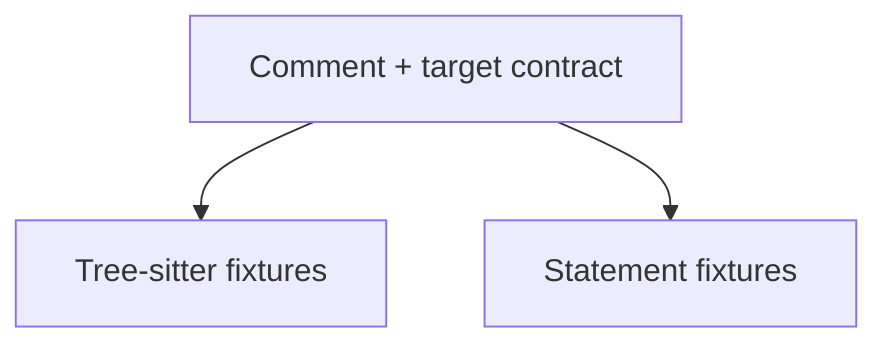

## Adapter test architecture



The shared helper scans source strings and exposes the anchor-to-declaration map.
Each branch asserts behavior for its language fixtures. Select a node to inspect
the tests; the Python fixture is included here even though its source lives in
`test_framework.py`.

## Run these checks

```sh
.venv/bin/python -m pytest tests/test_languages.py -q
.venv/bin/python -m pytest tests/test_framework.py -k python_decorators -q
```

## Comment and declaration binding {#binding}

`bound()` calls the selected language scanner and turns parsed comments into a map
from anchor IDs to symbol names, kinds, and notes. Language tests assert against
that map and the declaration targets. `test_parse_tag_comment_styles()` checks
C-style, line, hash, and shebang-style comment decoration and note extraction.

Fixture strings intentionally contain sample tags such as `k.fn`. They are input
data for the tests, not documentation anchors for this wiki. The Python scanner
recognizes the real `test-framework.*` and `test-languages.*` comments above test declarations as wiki bindings.

## Tree-sitter adapter evidence {#parsers}

| Adapter | Assertions exercised |
| --- | --- |
| C | Macros, typedefs, enums, variables, functions, guarded declarations, prototype classification, and top-level filtering |
| YAML | Mapping keys, list items, and nested qualified paths |
| Devicetree | Nodes, references, properties, macros, qualified paths, and attached notes |
| Python | Decorated methods, qualified names, asynchronous functions, comment groups, and decorator-inclusive byte ranges |

C, YAML, and devicetree cases live in `test_languages.py`; the Python case lives in
`test_framework.py`. These tests establish the behavior of the supplied fixtures.
They do not prove complete grammar coverage or infer runtime call relationships.

## Statement-scanner boundaries {#statements}

The configuration and build-language tests cover `.conf` assignments and unset
options; Make variables, rules, and conditionals; Kconfig options; CMake commands;
and shell functions and assignments. Make checks that a continued rule includes
its recipe lines. Kconfig checks the option's help block boundary, and shell checks
the function's final line. These assertions protect the source ranges readers see.

