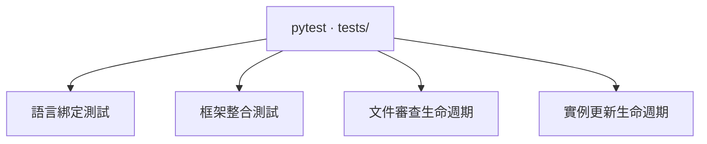

## 測試架構 {#test-architecture}



**選擇測試層深入閱讀。** 語言測試資料隔離剖析與綁定行為；暫存專案則一起驗證框架元件。子頁各有圖表，將每個測試領域連到原始碼中的斷言。這些是驗證層，不是正式建置管線中的相依關係。

## 執行與選擇測試 {#run-and-select-tests}

安裝開發相依套件後，在框架儲存庫執行以下命令。`pyproject.toml` 設定 pytest 從 `tests/` 探索測試。

```sh
.venv/bin/python -m pytest -q
.venv/bin/python -m pytest tests/test_languages.py -q
.venv/bin/python -m pytest tests/test_framework.py -q
.venv/bin/python -m pytest tests/test_review.py -q
.venv/bin/python -m pytest tests/test_update.py -q
.venv/bin/python -m pytest tests/test_framework.py -k 'diagram or architecture' -q
.venv/bin/python -m pytest --collect-only -q
.venv/bin/codewiki build --strict
```

參數化案例會展開成多個 pytest 測試；目前案例數以測試收集結果為準。嚴格 Wiki 建置是對 Markdown 結構與原始碼綁定的獨立檢查，不會執行 pytest。

LLM 不必載入整頁，也能使用同樣的閱讀路徑：

```sh
.venv/bin/codewiki query doc testing
.venv/bin/codewiki query section test-framework.diagrams
.venv/bin/codewiki query symbol tests.test_framework.test_diagrams_share_dependencies_with_cli_and_resolve_exact_ids
.venv/bin/codewiki query source tests.test_framework.test_diagrams_share_dependencies_with_cli_and_resolve_exact_ids --limit 30
```

## 額外驗證與目前缺口 {#additional-verification-and-current-gaps}

儲存庫中的 pytest 套件涵蓋 Python 行為與產生的檔案，包括審查狀態轉換及 CI 結束碼。[審查測試](reviews.html#tests) 確認重新建置不能確認審查，且未涵蓋原始碼維持在範圍外。下列檢查是獨立活動，尚未形成自動化瀏覽器或發行測試套件：

- **瀏覽器檢查：** 開啟架構圖，沿元件前往章節、展開原始碼、測試圖表展開與鍵盤導覽，並在窄視窗中檢查溢出及主控台錯誤。
- **已安裝套件的基本檢查：** 建置 wheel，在另一個環境安裝，於此工作目錄外初始化暫存專案並嚴格建置。確認主題資產、範本與技能都包含在套件中。
- **原始引擎比較：** 對相同原始碼狀態，使用兩個引擎建置目標專案文件，再比較錨點與原始碼綁定。單元測試資料不足以證明完整 P721 專案相容性。

此套件沒有納入版本管理的瀏覽器自動化、效能或涵蓋率門檻檢查。測試與文件應說明實際斷言的保證，不應把成功執行視為整個程式碼庫完整涵蓋的證據。

## 隨行為變更擴充測試 {#extend-the-tests-with-a-behavior-change}

修改掃描器時，在 `test_languages.py` 加入最小語法測試資料。跨越剖析、驗證、渲染或查詢的變更，在 `test_framework.py` 使用暫存專案案例。修復錯誤時，先重現失敗輸入，再對可觀察結果或應保留的檔案狀態做斷言。

將對應的 `test-framework.*` 或 `test-languages.*` 原始碼標籤保留在測試宣告上方，也要放在裝飾器之前。自我說明 Wiki 會掃描 `tests/`，因此測試函式改名或行範圍改變後，仍可透過相同穩定文件章節存取。
