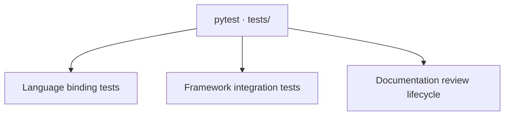

## Test architecture



**Choose a test layer to go deeper.** Language fixtures isolate parsing and binding;
temporary projects exercise the framework components together. The child pages
contain their own diagrams and link each test area to the assertions in source.
These are verification layers, not dependencies in the production build pipeline.

## Run and select tests

Run these commands from the framework repository, after installing its development
dependencies. `pyproject.toml` configures pytest to discover `tests/`.

```sh
.venv/bin/python -m pytest -q
.venv/bin/python -m pytest tests/test_languages.py -q
.venv/bin/python -m pytest tests/test_framework.py -q
.venv/bin/python -m pytest tests/test_review.py -q
.venv/bin/python -m pytest tests/test_framework.py -k 'diagram or architecture' -q
.venv/bin/python -m pytest --collect-only -q
.venv/bin/codewiki build --strict
```

Parameterized cases expand into multiple pytest tests; collection is the source of
truth for the current case count. The strict wiki build is a separate check of
Markdown structure and source bindings, not a command that runs pytest.

For an LLM, the same reading path is available without loading this entire page:

```sh
.venv/bin/codewiki query doc testing
.venv/bin/codewiki query section test-framework.diagrams
.venv/bin/codewiki query symbol tests.test_framework.test_diagrams_share_dependencies_with_cli_and_resolve_exact_ids
.venv/bin/codewiki query source tests.test_framework.test_diagrams_share_dependencies_with_cli_and_resolve_exact_ids --limit 30
```

## Additional verification and current gaps

The committed pytest suite covers Python behavior and generated files, including
review transitions and CI exit codes. [Review tests](reviews.html#tests) check
that rebuilds cannot acknowledge a review and uncovered source stays out of scope. The following
checks remain separate activities, rather than an automated browser or release suite:

- **Browser review:** open the architecture map, follow a component into a section,
  expand its source, test diagram expansion and keyboard navigation, and inspect a
  narrow viewport for overflow and console errors.
- **Installed-package smoke check:** build a wheel, install it in another environment,
  initialize a temporary project outside this checkout, and run a strict build.
  Confirm that theme assets, templates, and skills were included.
- **Original-engine comparison:** build the target project's documentation with both
  engines against the same source state, then compare anchors and source bindings.
  The unit fixtures alone do not establish full P721 project compatibility.

There are no committed browser automation, performance, or coverage-threshold checks
in this suite. Tests and documentation should state the guarantee actually asserted,
not treat a successful run as evidence of complete codebase coverage.

## Extend the tests with a behavior change

Add a minimal syntax fixture in `test_languages.py` when changing a scanner. For
changes that cross parsing, validation, rendering, or queries, use a temporary-project
case in `test_framework.py`. When fixing a bug, first capture the failing input and
assert the observable result or preserved file state.

Keep the relevant `test-framework.*` or `test-languages.*` source tag above the test declaration, including above
its decorators. The self-wiki scans `tests/`, so renamed test functions and changed
line ranges remain reachable through the same stable documentation section.
